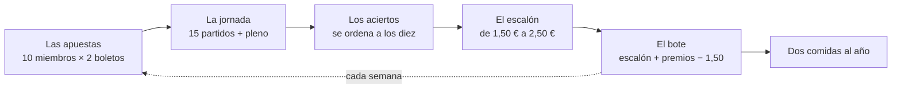
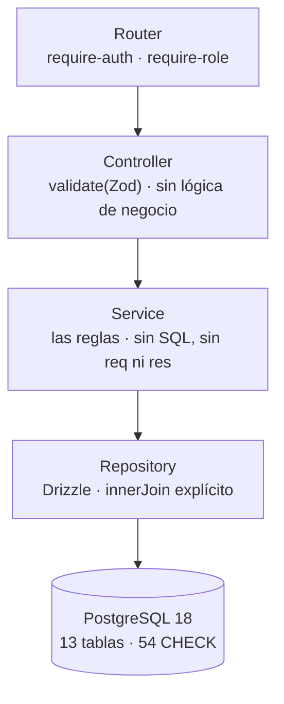
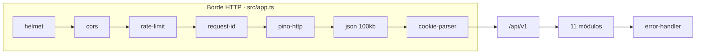
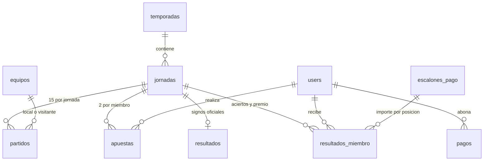
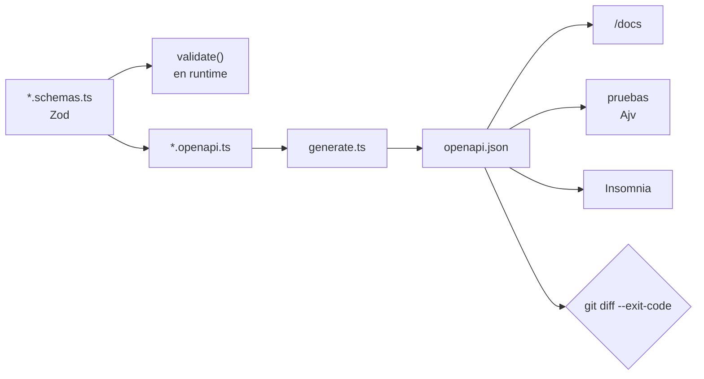

# quini-api

API REST autenticada para la gestión de una peña de quiniela real, en funcionamiento desde hace más de treinta años y gestionada hasta ahora con una hoja de cálculo.

Trabajo de Fin de Máster — Máster en Desarrollo con IA · Javier Fernández

|                         |                                       |
| ----------------------- | ------------------------------------- |
| **Contrato navegable**  | https://api.quiniweb.com/docs         |
| **Contrato en crudo**   | https://api.quiniweb.com/openapi.json |
| **Estado del servicio** | https://api.quiniweb.com/health       |

Los tres son **públicos**: no hacen falta credenciales para recorrer las 51 operaciones con sus ejemplos. Para consultar datos, ver [Usuario de prueba](#f-usuario-y-contraseña-de-prueba).

---

## Índice

- [a. Descripción general](#a-descripción-general)
- [b. Stack tecnológico](#b-stack-tecnológico)
- [c. Instalación y ejecución](#c-instalación-y-ejecución)
- [d. Estructura del proyecto](#d-estructura-del-proyecto)
- [e. Funcionalidades principales](#e-funcionalidades-principales)
- [f. Usuario y contraseña de prueba](#f-usuario-y-contraseña-de-prueba)
- [Documentación ampliada](#documentación-ampliada)

---

## a. Descripción general

La peña la forman **10 miembros**. Cada semana cada uno juega **2 apuestas** de quiniela, que cuestan 1,50 € (2 × 0,75 €). Una vez disputada la jornada se cuentan los aciertos y se ordena a los diez: a cada posición le corresponde un **escalón de pago** de entre 1,50 € y 2,50 €. De lo que paga cada miembro, 1,50 € cubre los boletos y **el resto engorda el bote**, que financia un par de comidas al año.

El objetivo no es acertar la quiniela: es mantener la costumbre y que se pague sola.



Esta API es **la primera pieza de un sistema más amplio**. El alcance de este TFM se limita deliberadamente al backend: la persistencia, la lógica de negocio y el contrato HTTP. Quedan fuera —por diseño, no por omisión— un frontend web, su empaquetado como aplicación móvil y la capa de observabilidad. Las tres están contempladas y la API ya reserva los puntos de extensión que necesitan.

### En cifras

|            |                                            |
| ---------: | ------------------------------------------ |
|     **51** | operaciones REST sobre 34 rutas            |
|     **11** | módulos de negocio, con las mismas 4 capas |
|     **13** | tablas y 8 migraciones versionadas         |
|    **244** | casos de prueba, sin un solo mock          |
| **96,2 %** | de sentencias cubiertas                    |
|     **26** | decisiones de arquitectura registradas     |

---

## b. Stack tecnológico

| Área          | Elección                                                         | Por qué                                                                     |
| ------------- | ---------------------------------------------------------------- | --------------------------------------------------------------------------- |
| Lenguaje      | **TypeScript 5.7** sobre **Node 22**, ESM nativo                 | `strict`, `noUncheckedIndexedAccess` y `exactOptionalPropertyTypes`         |
| HTTP          | **Express 5**                                                    | routers anidados; `app.ts` se exporta sin abrir socket, para poder probarlo |
| Seguridad     | **helmet**, **cors**, **express-rate-limit**, **cookie-parser**  | cabeceras, origen por entorno y límite antes de tocar la base               |
| Autenticación | **jose** (JWT), **@node-rs/argon2**, **google-auth-library**     | access token corto + refresh opaco revocable                                |
| Validación    | **Zod 4**                                                        | una definición valida la petición y describe la respuesta                   |
| Contrato      | **zod-openapi**, **Spectral**, **swagger-ui-express**            | OpenAPI 3.1 generado del código, no escrito aparte                          |
| Datos         | **Drizzle ORM** + **drizzle-kit**, **PostgreSQL 18**             | esquema en TypeScript, migraciones SQL versionadas                          |
| Pruebas       | **Vitest 4**, **Supertest**, **embedded-postgres**, **Ajv**      | PostgreSQL real, y cada respuesta validada contra el contrato               |
| Calidad       | **ESLint 10**, **Prettier**, **husky** + **lint-staged**         | `lint-staged && typecheck` en cada commit                                   |
| Registro      | **pino** + **pino-http**, `AsyncLocalStorage`                    | log estructurado con `requestId` propagado                                  |
| Despliegue    | **Docker** multietapa, **Caddy 2**, **GitHub Actions**, **GHCR** | imagen del commit exacto, HTTPS automático                                  |

Decisión transversal: **el mismo motor de base de datos en los tres entornos**. Ninguna prueba usa SQLite ni un doble; las 54 restricciones `CHECK` de la base están vigentes también durante los tests.

---

## c. Instalación y ejecución

### Requisitos

- **Node.js ≥ 22.6**
- **Docker** (solo para la base de datos de desarrollo; las pruebas no lo necesitan)

### Puesta en marcha

```bash
git clone https://github.com/afayaizu-dev/quini-api.git
cd quini-api
npm ci

cp .env.example .env          # revisa JWT_SECRET y COOKIE_SECRET: mínimo 32 caracteres

npm run db:up                 # levanta PostgreSQL 18 en :5432 y Adminer en :8080
npm run db:migrate            # aplica las 8 migraciones

npm run admin:create -- --email=admin@quini.local --nombre=Admin
                              # pide una contraseña por consola (mínimo 12 caracteres)

npm run dev                   # http://localhost:3000
```

Con eso, el contrato queda en <http://localhost:3000/docs>.

> El arranque **falla a propósito** si falta o es inválida cualquier variable de entorno: `src/config/env.ts` valida todo con Zod y hace `exit(1)`. No hay modo degradado silencioso.

### Ejecutar las pruebas

```bash
npm test          # 244 casos; levanta un PostgreSQL embebido y lo destruye al acabar
npm run test:cov  # lo mismo, con informe de cobertura
```

**No hace falta Docker ni base de datos previa**: `tests/setup/global-setup.ts` busca un puerto libre, arranca `embedded-postgres` en un directorio temporal, le aplica las migraciones reales del repositorio y lo tira al terminar.

### Comandos disponibles

| Comando                                                 | Qué hace                                             |
| ------------------------------------------------------- | ---------------------------------------------------- |
| `npm run dev`                                           | servidor en modo watch                               |
| `npm test` / `npm run test:cov`                         | suite completa / con cobertura                       |
| `npm run typecheck` / `npm run lint` / `npm run format` | tsc, ESLint, Prettier                                |
| `npm run db:up` / `db:down` / `db:reset`                | PostgreSQL de desarrollo                             |
| `npm run db:generate` / `db:migrate` / `db:studio`      | migraciones y explorador de Drizzle                  |
| `npm run openapi:generate` / `openapi:lint`             | regenerar el contrato y pasarle Spectral             |
| `npm run insomnia:generate`                             | regenerar la colección de Insomnia desde el contrato |
| `npm run admin:create` / `npm run token`                | crear un admin / emitir un token de pruebas          |
| `npm run carga`                                         | carga histórica desde `seed/*.csv`                   |
| `npm run build` / `npm start`                           | compilar a `dist/` y ejecutar                        |

---

## d. Estructura del proyecto

```
quini-api/
├── src/
│   ├── app.ts                 # la aplicación, sin abrir socket (así se puede probar)
│   ├── server.ts              # lo único que escucha en un puerto
│   ├── routes.ts              # monta los 11 routers bajo /api/v1
│   ├── config/env.ts          # esquema Zod de todo el entorno; falla al arrancar si algo falta
│   ├── core/                  # errores tipados, contexto de petición, utilidades
│   ├── middleware/            # requireAuth, requireRole, validate, rate-limit, errores, logging
│   ├── db/schema/             # 13 tablas en TypeScript (Drizzle)
│   ├── openapi/               # registro y generación del contrato
│   └── modules/               # 11 módulos de negocio
├── drizzle/                   # 8 migraciones SQL versionadas
├── tests/                     # 20 ficheros · 244 casos (17 de integración, 3 unitarios)
├── docker/                    # compose de desarrollo y producción, Caddyfile, backup
├── scripts/                   # admin, tokens, migración y carga de datos
├── seed/                      # los datos históricos en CSV
├── openapi/openapi.json       # el contrato publicado (generado, verificado en CI)
├── insomnia/                  # colección generada desde el contrato
└── docs/                      # 19 guías + 26 ADR + 30 diagramas
```

### Los 11 módulos, siempre con las mismas 4 capas

Cada módulo son seis ficheros: `routes`, `controller`, `service`, `repository`, `schemas` y `openapi`. La regla de dependencia es unidireccional y no tiene excepciones.



### El camino de una petición



Antes del router de negocio se sirven `/health`, `/openapi.json` y la interfaz de `/docs`. Todo error acaba en un único middleware: una sola forma de respuesta de error en toda la API.

---

## e. Funcionalidades principales

### Dominio



> Núcleo del dominio, con los nombres reales de las tablas. Se omiten las tres
> de autenticación —`invitations`, `refresh_tokens` y `oauth_accounts`— para no
> mezclar dos historias en un diagrama. Las 13 están en
> [`src/db/schema/`](src/db/schema/).

| Módulo          | Qué resuelve                                                                        |
| --------------- | ----------------------------------------------------------------------------------- |
| **auth**        | Login por contraseña, refresh rotado, revocación, logout global y acceso con Google |
| **invitations** | Alta cerrada: invitación de un solo uso con caducidad, emitida por un admin         |
| **usuarios**    | Perfil de los miembros y consulta propia                                            |
| **temporadas**  | Alta, activación y cierre; solo una temporada activa a la vez                       |
| **equipos**     | Catálogo de equipos, con nombre largo y corto                                       |
| **jornadas**    | Ciclo de vida de la jornada y sus 15 partidos                                       |
| **apuestas**    | Las dos apuestas de cada miembro, con sus 14 signos y el pleno al 15                |
| **resultados**  | Los signos oficiales y los premios por categoría (10 a 15)                          |
| **calculos**    | Aciertos, escalón de pago, premios y bote — el núcleo del negocio                   |
| **pagos**       | Registro de pagos al tesorero, crédito y deuda arrastrada                           |
| **dashboard**   | Agregados por miembro, por jornada y por temporada                                  |

### Seguridad

- **Acceso cerrado**: no hay registro abierto. Se entra con una invitación de un solo uso emitida por un admin — y **el acceso con Google también la exige**.
- **Contraseñas con Argon2id** (19 MiB, 2 pasadas, 1 hilo: la configuración que recomienda OWASP).
- **Access token JWT de vida corta** más **refresh token opaco** guardado solo como SHA-256. Al refrescar se rota; si llega uno ya revocado, **se invalida toda la familia** y la sesión cae entera.
- **Autorización por rol** (`user` / `admin`), reforzada con una restricción `CHECK` en la base.
- **Límite de tasa**, cabeceras de seguridad, cuerpos limitados y un único middleware de errores que nunca devuelve trazas.

### El contrato como fuente única

El esquema Zod de cada endpoint valida la petición **y** describe la respuesta: se le pasa el mismo objeto a `zod-openapi`. De ahí salen `openapi.json`, la interfaz de `/docs`, la colección de Insomnia y el aserto de cada prueba. En integración continua se regenera y se compara: **si el código cambia y el contrato no, la build falla**.



### Calidad

244 casos en 20 ficheros, **ninguno con mocks**: cada prueba de integración monta la aplicación completa y llega a un PostgreSQL real con las migraciones aplicadas. Cada respuesta se valida contra el esquema publicado. Cobertura medida: **96,2 % de sentencias y 92,4 % de ramas**, con umbral obligatorio del 100 % en los diez `service` y en el algoritmo de cálculo.

### Despliegue

`ci.yml` valida cada push y cada PR (typecheck, lint, pruebas, contrato sin deriva). `deploy.yml` construye la imagen, la publica en GHCR etiquetada con el SHA del commit y la despliega por SSH: `pull → migrate → up -d → curl /health`. En el VPS corren tres contenedores —Caddy, la API y PostgreSQL— y **solo Caddy publica puertos**.

---

## f. Usuario y contraseña de prueba

> [!NOTE]
> **Pendiente de completar antes de la entrega.** Crear la cuenta desde `/docs` con
> `POST /api/v1/invitaciones` (rol `user`) y después `POST /api/v1/auth/register`.

| Campo      | Valor                         |
| ---------- | ----------------------------- |
| URL        | https://api.quiniweb.com/docs |
| Usuario    | `[completar]`                 |
| Contraseña | `[completar]`                 |
| Rol        | `user`                        |

La cuenta tiene rol **`user`** deliberadamente: da acceso de lectura a 19 de las 22 operaciones de consulta y **ninguna capacidad destructiva**. Las tres restantes (`GET /usuarios`, `GET /usuarios/{id}` y `GET /pagos`) devolverán `403 FORBIDDEN`: no es una limitación del acceso concedido, es la autorización por rol funcionando.

### Recorrido sugerido

1. Abrir `/docs` y pulsar **Authorize** → `oauth2Password` con las credenciales de arriba.
2. `GET /auth/me` — la identidad resuelta desde el JWT.
3. `GET /temporadas` y `GET /jornadas` — el calendario real de la peña.
4. `GET /jornadas/{n}` — una jornada con sus 15 partidos.
5. `GET /jornadas/{n}/apuestas` y `GET /jornadas/{n}/resultados`.
6. `GET /calculos` — la liquidación: aciertos, escalón y premio por miembro.
7. `GET /dashboard/temporada` — el agregado de la temporada completa.
8. `GET /usuarios` — **403 esperado**, la autorización por rol en acción.
9. Cualquier operación sin pulsar Authorize — **401 esperado**.

### Dos avisos operativos

- **El access token dura 15 minutos.** Al caducar, Swagger UI devolverá `401`: basta con volver a pulsar Authorize. La sesión se conserva entre recargas de la página.
- **Hay un límite de 10 intentos fallidos cada 15 minutos** en las rutas de autenticación. Si la contraseña se teclea mal varias veces, la respuesta pasa a `429 TOO_MANY_REQUESTS` durante unos minutos. No es un fallo del servicio.

---

## Documentación ampliada

Todo el detalle está en [`docs/`](docs/): 19 guías técnicas, 26 decisiones de arquitectura y 30 diagramas fuente editables.

| Documento                                                                                                 | Contenido                                           |
| --------------------------------------------------------------------------------------------------------- | --------------------------------------------------- |
| [`docs/TFM-Documento-Proyecto.md`](docs/TFM-Documento-Proyecto.md)                                        | La memoria completa del proyecto                    |
| [`docs/adr/`](docs/adr/)                                                                                  | Las 26 decisiones, con sus alternativas descartadas |
| [`docs/02-Autenticacion.md`](docs/02-Autenticacion.md)                                                    | Tokens, roles, invitaciones y Google, paso a paso   |
| [`docs/03-OpenAPI.md`](docs/03-OpenAPI.md)                                                                | Cómo se genera y se verifica el contrato            |
| [`docs/04-Testing.md`](docs/04-Testing.md)                                                                | Estrategia de pruebas y banco de trabajo            |
| [`docs/06-ServiciosNegocio.md`](docs/06-ServiciosNegocio.md)                                              | Anatomía de un módulo                               |
| [`docs/07-Servicios_adicionales.md`](docs/07-Servicios_adicionales.md)                                    | El algoritmo de cálculo, con ejemplos numéricos     |
| [`docs/09-Docker.md`](docs/09-Docker.md) · [`docs/10-...VPS.md`](docs/10-Configuracion-Despliegue-VPS.md) | Contenedores, servidor y operación                  |
| [`docs/11-Carga-de-datos.md`](docs/11-Carga-de-datos.md)                                                  | La carga histórica desde CSV                        |
| [`docs/artefactos.md`](docs/artefactos.md)                                                                | Índice de los diagramas y páginas interactivas      |

---

<sub>Proyecto privado, sin licencia de uso. Los datos de `seed/` corresponden a una peña real.</sub>
