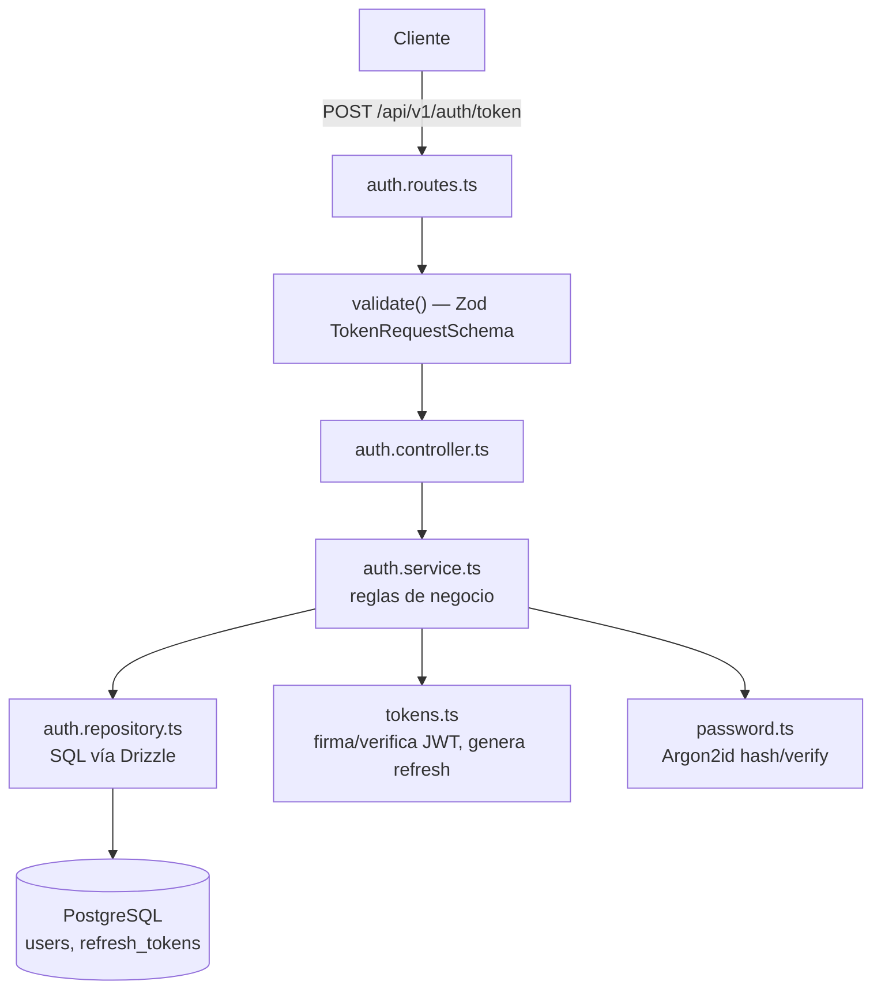
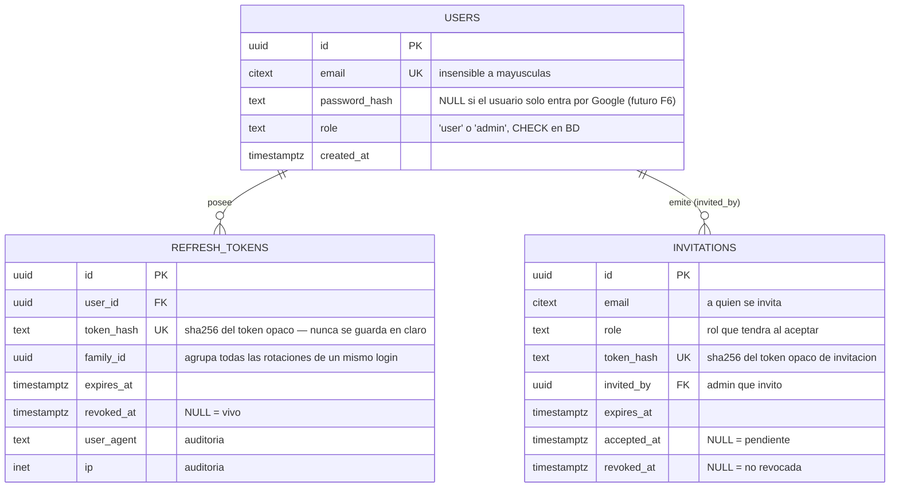
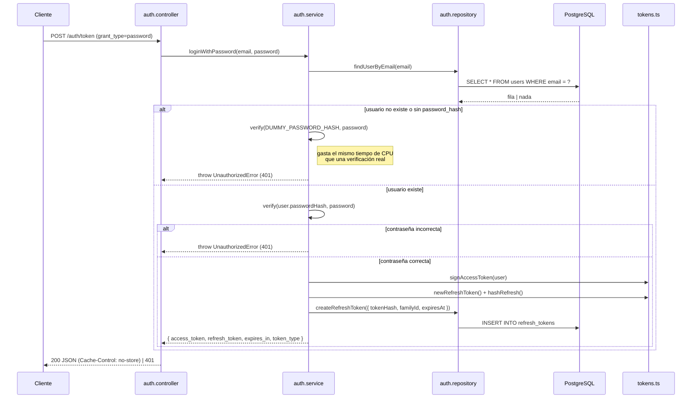
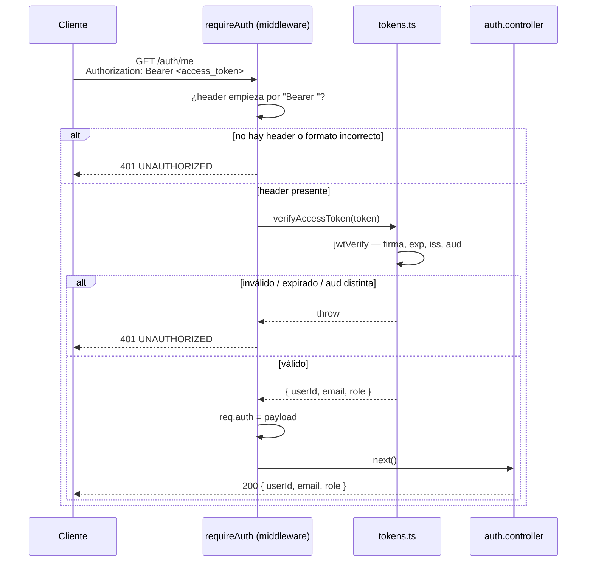
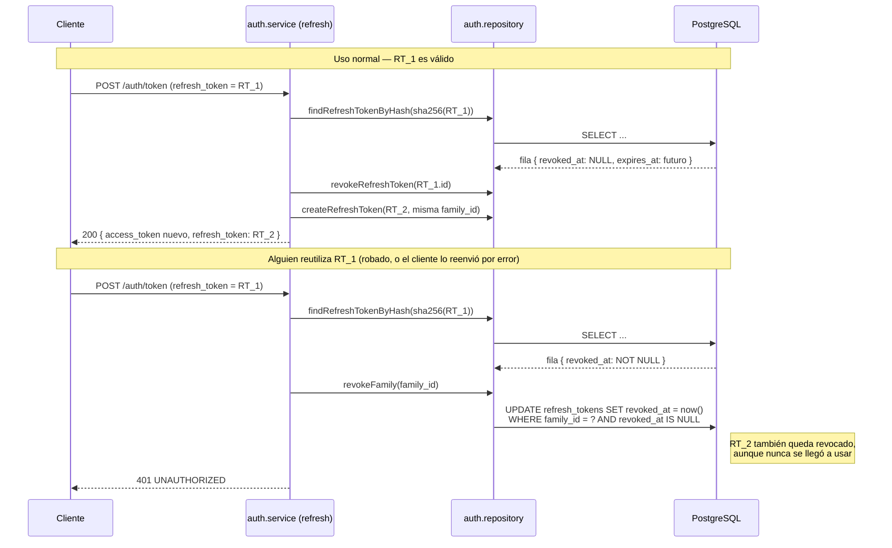
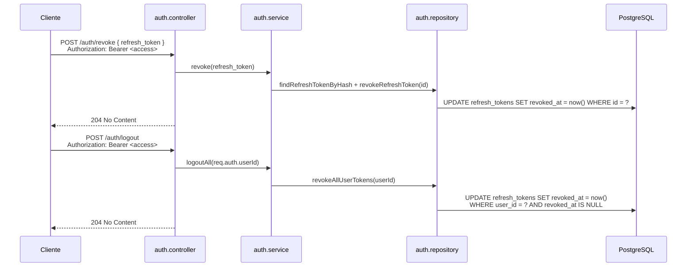
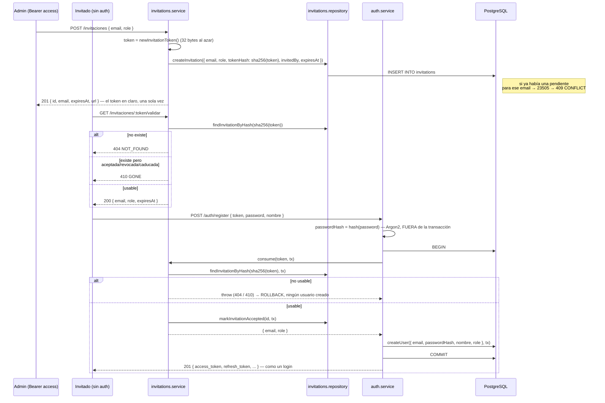

# Sistema de autenticación y autorización

> **Ámbito de este documento**: lo implementado en **F4** (login por contraseña, tokens de acceso y refresco, revocación, logout y autorización por rol) y **F5** (invitaciones y registro cerrado) del plan (`00-Plan-inicial.md`). F6 (Google) todavía no está construido; cuando lo esté, este documento se ampliará.
>
> **Para quién**: documento de estudio. El objetivo no es solo describir "qué hace" el código, sino **por qué** está hecho así, para poder defenderlo en una entrevista o code review.

---

## Índice

1. [Autenticación vs. autorización](#1-autenticación-vs-autorización)
2. [Visión general de las piezas](#2-visión-general-de-las-piezas)
3. [Modelo de datos](#3-modelo-de-datos)
4. [Contraseñas: Argon2id](#4-contraseñas-argon2id)
5. [El access token (JWT)](#5-el-access-token-jwt)
6. [El refresh token (opaco)](#6-el-refresh-token-opaco)
7. [Flujo 1 — Login con contraseña](#7-flujo-1--login-con-contraseña)
8. [Flujo 2 — Petición autenticada](#8-flujo-2--petición-autenticada)
9. [Flujo 3 — Refresh, rotación y detección de reuso](#9-flujo-3--refresh-rotación-y-detección-de-reuso)
10. [Flujo 4 — Revoke y logout](#10-flujo-4--revoke-y-logout)
11. [Flujo 5 — Invitaciones y registro cerrado](#11-flujo-5--invitaciones-y-registro-cerrado)
12. [Autorización por rol](#12-autorización-por-rol)
13. [Manejo de errores](#13-manejo-de-errores)
14. [Catálogo de endpoints](#14-catálogo-de-endpoints)
15. [Herramientas de desarrollo](#15-herramientas-de-desarrollo)
16. [Lo que falta / decisiones pendientes](#16-lo-que-falta--decisiones-pendientes)
17. [Glosario](#17-glosario)

---

## 1. Autenticación vs. autorización

Son dos preguntas distintas y el sistema las responde con mecanismos distintos:

| Pregunta            | Nombre técnico    | Código responsable              | Si falla →           |
| ------------------- | ----------------- | ------------------------------- | -------------------- |
| ¿Quién eres?        | **Autenticación** | `requireAuth` (verifica el JWT) | **401** Unauthorized |
| ¿Puedes hacer esto? | **Autorización**  | `requireRole('admin')`          | **403** Forbidden    |

Es un error común devolver 403 cuando en realidad no sabes quién es el usuario (sin token, o token inválido) — ahí siempre es 401. 403 significa "te identifiqué perfectamente, y precisamente por eso sé que no puedes".

---

## 2. Visión general de las piezas



Cada fichero tiene una única responsabilidad (arquitectura en capas, §5 del plan):

| Fichero              | Responsabilidad                                                             | Nunca hace                  |
| -------------------- | --------------------------------------------------------------------------- | --------------------------- |
| `auth.routes.ts`     | Declara rutas y qué middlewares/esquema aplica a cada una                   | Lógica de negocio           |
| `auth.controller.ts` | Traduce HTTP ↔ dominio: lee `req`, llama al service, elige código de estado | Tocar la base de datos      |
| `auth.service.ts`    | Reglas de negocio: verificar contraseña, rotar refresh, detectar reuso      | Tocar `req`/`res`           |
| `auth.repository.ts` | Consultas SQL con Drizzle                                                   | Decidir códigos HTTP        |
| `tokens.ts`          | Firmar/verificar JWT, generar y hashear el refresh opaco                    | Reglas de negocio           |
| `password.ts`        | Hash y verificación de contraseñas con Argon2id                             | Nada relacionado con tokens |

---

## 3. Modelo de datos



Tres detalles de diseño que valen una pregunta de entrevista:

- **`token_hash` es `UNIQUE`**, no `user_id`: un usuario puede tener varios refresh tokens vivos a la vez (uno por dispositivo/sesión). Lo que nunca se repite es el hash de un token concreto.
- **`family_id` no es lo mismo que `user_id`**. Cada _login_ nuevo genera una `family_id` nueva (`randomUUID()` en `issueTokenPair`). Cada _rotación_ dentro de ese login mantiene la misma `family_id`. Por eso al detectar un reuso se puede revocar "esta sesión concreta" sin desloguear al usuario de sus otros dispositivos — eso es justo lo que hace `revokeFamily`, distinto de `revokeAllUserTokens` que usa `logout`.
- **`invitations` no tiene una columna `UNIQUE` simple en `email`** — tiene un **índice único parcial**: `UNIQUE(email) WHERE accepted_at IS NULL AND revoked_at IS NULL`. Esto permite que un email tenga varias invitaciones **a lo largo del tiempo** (una caducó, se generó otra), pero nunca dos **pendientes** a la vez. Es la base de datos, no el código de la aplicación, quien garantiza esa regla — inmune a bugs o a una segunda instancia del servidor escribiendo a la vez.

---

## 4. Contraseñas: Argon2id

```ts
// src/modules/auth/password.ts
const ARGON2_OPTIONS = { memoryCost: 19456, timeCost: 2, parallelism: 1 };
```

- **Por qué Argon2id y no bcrypt**: es la recomendación actual de OWASP. bcrypt tiene un coste fijo de CPU y es vulnerable a ataques con GPU/ASIC porque apenas usa memoria; Argon2 obliga a reservar memoria (`memoryCost` ≈ 19 MiB por hash), lo que encarece mucho paralelizar el ataque en hardware especializado.
- **Nunca se guarda la contraseña en claro**, ni siquiera un momento: `createUser` recibe `passwordHash`, ya calculado en el controller/service, no la contraseña original.
- El hash de Argon2 **incluye la sal y los parámetros** en el propio string de salida (formato `$argon2id$v=19$m=19456,t=2,p=1$...`), así que no hace falta guardar la sal en una columna aparte.

---

## 5. El access token (JWT)

```ts
// src/modules/auth/tokens.ts
new SignJWT({ email: user.email, role: user.role })
  .setProtectedHeader({ alg: "HS256" })
  .setSubject(user.id)
  .setIssuer(env.JWT_ISSUER) // "api-quini"
  .setAudience(env.JWT_AUDIENCE) // "api-quini-clients"
  .setIssuedAt()
  .setExpirationTime(env.ACCESS_TOKEN_TTL) // "15m"
  .sign(secret);
```

Claims del payload:

| Claim         | Valor                 | Para qué                                                                     |
| ------------- | --------------------- | ---------------------------------------------------------------------------- |
| `sub`         | `user.id` (UUID)      | Identifica al usuario sin otra consulta a BD                                 |
| `email`       | email del usuario     | Comodidad para el cliente/logs                                               |
| `role`        | `"user"` \| `"admin"` | Autorización sin ir a BD — el middleware `requireRole` lo lee directamente   |
| `iss`         | `"api-quini"`         | Quién emitió el token                                                        |
| `aud`         | `"api-quini-clients"` | Para quién es válido. Un token de otra `aud` **debe** fallar la verificación |
| `iat` / `exp` | emisión / caducidad   | 15 minutos de vida (`ACCESS_TOKEN_TTL`)                                      |

`verifyAccessToken` comprueba **firma + `exp` + `iss` + `aud`** con `jwtVerify` (librería `jose`). Omitir la comprobación de `aud`/`iss` es un agujero real: sin ella, un JWT emitido para _otro_ servicio pero firmado con el mismo secreto (o filtrado de otro entorno) se aceptaría igual.

**¿Por qué el access token es tan corto (15 min) y no se puede revocar?** Un JWT es _autocontenido_: el servidor lo valida solo con la firma, sin tocar la base de datos — esto es lo que lo hace rápido y escalable (no hay lookup en cada petición). El precio es que, una vez emitido, **no hay forma de invocarlo antes de que caduque** salvo cambiar el secreto de firma (lo que invalidaría _todos_ los tokens de golpe). Por eso vive poco: si se filtra, la ventana de abuso es corta. El control fino de revocación vive en el refresh token, que sí se consulta en BD.

**HS256 hoy, RS256 en producción (pendiente, D9 del plan)**: HS256 firma y verifica con el **mismo** secreto simétrico — sencillo para desarrollo, pero significa que cualquier servicio que necesite _verificar_ el token también podría _firmar_ uno. RS256 usa un par de claves: se firma con la privada y se verifica con la pública, así un servicio de solo lectura no puede fabricar tokens.

---

## 6. El refresh token (opaco)

```ts
export function newRefreshToken(): string {
  return randomBytes(32).toString("base64url"); // 32 bytes al azar, sin estructura
}
export function hashRefresh(token: string): string {
  return createHash("sha256").update(token).digest("hex");
}
```

- **"Opaco" significa que no lleva información dentro** (a diferencia del JWT): es solo un valor aleatorio de 256 bits. El cliente lo guarda tal cual; el servidor solo guarda su **hash SHA-256** en `refresh_tokens.token_hash`.
- **¿Por qué hashearlo si ya es aleatorio y no un password?** Si alguien consigue leer la tabla `refresh_tokens` (un dump de BD filtrado, un backup mal guardado), el hash no le sirve para autenticarse — necesitaría el token original, que nunca se guarda. SHA-256 (no Argon2) es suficiente aquí porque el valor ya tiene alta entropía; no hace falta protegerlo contra fuerza bruta de diccionario como una contraseña humana.
- **Vive mucho más que el access token** (`REFRESH_TOKEN_TTL = 30d`), porque su función es distinta: permitir sesiones largas sin pedir contraseña otra vez, a cambio de quedar **completamente revocable** (a diferencia del JWT).

---

## 7. Flujo 1 — Login con contraseña



El detalle más importante de este flujo es **por qué "usuario no existe" y "contraseña incorrecta" devuelven exactamente el mismo error**:

```ts
if (!user || user.passwordHash === null) {
  await verify(DUMMY_PASSWORD_HASH, password); // <-- tiempo constante
  throw new UnauthorizedError();
}
const passwordOk = await verify(user.passwordHash, password);
if (!passwordOk) throw new UnauthorizedError();
```

Si el caso "no existe" respondiera _inmediatamente_ (sin llamar a `verify`) y el caso "existe pero mal" tardara los ~cientos de ms que cuesta Argon2, un atacante podría **medir el tiempo de respuesta** para descubrir qué emails están registrados (_timing attack_ / enumeración de usuarios), sin necesidad de ver el mensaje de error. Por eso se verifica siempre contra un `DUMMY_PASSWORD_HASH` (calculado una vez al arrancar, contra una contraseña aleatoria que nadie tiene) aunque el resultado se descarte — el tiempo de CPU gastado es el mismo en ambos casos.

`Cache-Control: no-store` en la respuesta es obligatorio por RFC 6749 (OAuth2): evita que un proxy/CDN/navegador cachee una respuesta que contiene tokens.

### Rate limiting contra fuerza bruta

`POST /auth/token` es el único endpoint donde alguien no autenticado puede probar credenciales repetidamente, así que lleva un limitador (`src/middleware/rate-limit.ts`) montado **antes** de la validación:

```ts
export const authRateLimit = rateLimit({
  windowMs: 15 * 60 * 1000,
  limit: 10,
  skipSuccessfulRequests: true,
  handler: (_req, res) => {
    res.status(429).json({ error: "TOO_MANY_REQUESTS", message: "...", requestId: getRequestId() });
  },
});
```

```ts
authRouter.post("/token", authRateLimit, validate({ body: TokenRequestSchema }), token);
```

- **`skipSuccessfulRequests: true`**: solo cuentan hacia el límite las respuestas de error (4xx/5xx). Un cliente legítimo que refresca su token cada pocos minutos son todas peticiones `200` y nunca activan el límite; el contador solo sube con intentos fallidos — el patrón típico de un ataque de fuerza bruta contra contraseñas o de escaneo de refresh tokens.
- **10 intentos fallidos / 15 min, por IP** (clave por defecto de `express-rate-limit`): margen amplio para un error humano, estrecho para un script.
- **`handler` personalizado**: en vez de la respuesta por defecto de la librería, devuelve la misma forma `{error, message, requestId}` que usa `error-handler.ts` para el resto de errores de la API — el cliente no puede distinguir un 429 de rate limit de cualquier otro error por la forma de la respuesta.
- **Pendiente para producción** (F12, detrás de Caddy): hay que activar `app.set('trust proxy', ...)` para que la librería lea la IP real del cliente desde `X-Forwarded-For` en vez de la del propio proxy — si no, todo el tráfico compartiría un único contador.

---

## 8. Flujo 2 — Petición autenticada



`requireAuth` (`src/middleware/require-auth.ts`) es el **único** sitio que sabe leer un JWT del header `Authorization`. Cualquier ruta protegida simplemente hace `authRouter.get("/me", requireAuth, me)` — el controller (`me`) nunca toca el header, solo lee `req.auth`, que ya viene validado. Esto es la ventaja de un middleware: la lógica de "¿quién eres?" está en un solo lugar, no repetida en cada controller.

---

## 9. Flujo 3 — Refresh, rotación y detección de reuso

Esta es la parte más delicada del sistema. La idea: **cada vez que se usa un refresh token, se destruye y se emite uno nuevo** ("rotación"). Si alguien intenta reutilizar uno ya gastado, es la señal de que ese token se filtró — y el sistema reacciona revocando **toda la familia** de tokens de esa sesión, no solo el que se reutilizó.



Código relevante (`auth.service.ts`):

```ts
export async function refresh(refreshToken: string, meta: RequestMeta) {
  const stored = await findRefreshTokenByHash(hashRefresh(refreshToken));
  if (!stored) throw new UnauthorizedError();

  if (stored.revokedAt !== null) {
    await revokeFamily(stored.familyId); // <-- la reacción a un reuso
    throw new UnauthorizedError();
  }
  if (stored.expiresAt < new Date()) throw new UnauthorizedError();

  const user = await findUserById(stored.userId);
  if (!user) throw new UnauthorizedError();

  await revokeRefreshToken(stored.id); // <-- rotación: el usado muere
  return issueTokenPair(user, meta, stored.familyId); // mismo familyId
}
```

**Por qué esto importa**: sin rotación, un refresh token robado seguiría siendo válido durante sus 30 días completos, indistinguible del legítimo. Con rotación + detección de reuso, en el momento en que **tanto el atacante como el usuario legítimo** intentan usar el mismo refresh token (porque el usuario legítimo seguía teniéndolo, sin saber que ya se usó/robó), el segundo intento revela la anomalía y corta el acceso a esa sesión entera. Es el patrón conocido como _refresh token rotation with automatic reuse detection_, el mismo que usan Auth0/Okta.

Verificado a mano en la sesión de pruebas de F4: login → refresh (rotación OK) → reutilizar el refresh viejo → 401 → probar el refresh _nuevo_ (nunca usado) → también 401, confirmando que toda la familia quedó revocada.

---

## 10. Flujo 4 — Revoke y logout

Dos operaciones parecidas pero con alcance distinto:

| Endpoint            | Revoca                                                           | Caso de uso                               |
| ------------------- | ---------------------------------------------------------------- | ----------------------------------------- |
| `POST /auth/revoke` | **un** refresh token concreto (el que envías en el body)         | "Cierra sesión en este dispositivo"       |
| `POST /auth/logout` | **todos** los refresh tokens del usuario (`revokeAllUserTokens`) | "Cierra sesión en todos los dispositivos" |



Ambos requieren `requireAuth` (necesitas un access token válido para poder cerrar sesión) y devuelven `204` — no hay cuerpo que devolver, la operación es "borrar", no "crear/leer".

`revoke` es intencionadamente permisivo: si el refresh token ya no existe o ya estaba revocado, no lanza error, simplemente no hace nada (`if (stored && stored.revokedAt === null)`). Cerrar una sesión que ya estaba cerrada no debería ser un fallo.

---

## 11. Flujo 5 — Invitaciones y registro cerrado

**Objetivo del diseño (Q2/D18 del plan)**: no hay registro público. La única forma de entrar es que un `admin` te invite (o, más adelante, que ya tengas cuenta y entres por Google). Un email sin invitación válida no puede crear una cuenta.

Tres operaciones, en tres ficheros nuevos que siguen el mismo patrón de capas que `auth` — `invitations.routes.ts` → `invitations.controller.ts` → `invitations.service.ts` → `invitations.repository.ts` — más una ampliación de `auth.service.ts`:



Decisiones que merece la pena entender, no solo copiar:

- **El token de invitación se genera y se hashea con el mismo patrón que el refresh token** (32 bytes aleatorios + SHA-256), pero **duplicado** en `invitations.service.ts` en vez de importado de `tokens.ts`. Es a propósito: `auth.service.ts` va a depender de `invitations.service.ts` (para `registerWithInvitation`), así que si `invitations` importara también de `auth`, la dependencia iría en las dos direcciones — justo lo que la arquitectura en capas prohíbe. Cuatro líneas duplicadas son más baratas que ese acoplamiento circular.
- **`validate()` (lectura pública) y `consume()` (escritura transaccional) comparten la misma comprobación de "¿sigue siendo usable?"** a través de un helper privado (`assertUsable`), pero son funciones distintas: `validate` nunca escribe nada (solo informa), `consume` es la única que marca `accepted_at` — y solo se llama desde dentro de una transacción.
- **`createUser` y `markInvitationAccepted` aceptan un parámetro `tx` opcional** (`tx: DbOrTx = db`). Por defecto usan la conexión normal (`db`), pero `registerWithInvitation` les pasa el `tx` de una transacción para que "crear el usuario" y "consumir la invitación" ocurran como una sola unidad: si cualquiera de las dos falla, Postgres deshace ambas (`ROLLBACK`) y no queda ni un usuario a medias ni una invitación reutilizable. `DbOrTx` es un tipo unión derivado del propio `db.transaction` (`src/db/index.ts`), no escrito a mano — así el código no depende de los tipos internos de Drizzle.
- **El hash de la contraseña se calcula _antes_ de abrir la transacción**: Argon2 tarda ~100 ms de CPU a propósito (§4); haría eso dentro de una transacción abierta mantendría bloqueos en la BD sin necesidad.
- **404 vs 410, sin dar más pistas**: un token que nunca existió da 404; un token que existió pero ya se usó, se revocó o caducó da 410 — y esos tres casos se agrupan en el mismo 410 para no filtrar el motivo exacto (§12).
- **Rate limit en `GET /invitaciones/:token/validar`**, con un limitador independiente del de `/auth/token` (`invitationRateLimit`, misma configuración, contador separado) — sin él, ese endpoint público sería un oráculo para probar tokens de invitación a lo bruto.
- **`RegisterRequestSchema` exige `password.min(12)`**, igual que `create-admin.ts` comprobaba a mano — es el punto donde un usuario **fija** su contraseña por primera vez, así que es donde se aplica la política mínima (a diferencia del login, que solo _comprueba_ una contraseña que ya existe).

---

## 12. Autorización por rol

```ts
// src/middleware/require-role.ts
export function requireRole(role: "user" | "admin") {
  return (req, _res, next) => {
    if (req.auth?.role !== role) throw new ForbiddenError();
    next();
  };
}
```

Uso previsto (todavía sin rutas que lo consuman — llegará con `temporadas`/`jornadas`, F10/F11):

```ts
router.post("/jornadas", requireAuth, requireRole("admin"), crearJornada);
```

**Detalle importante para no dar por hecho**: la comparación es `!==`, no una jerarquía. `requireRole("admin")` exige _exactamente_ rol `"admin"` — un admin no "hereda" automáticamente los permisos de `"user"` porque en este sistema solo hay dos roles planos, sin orden entre ellos (Q3/D19 del plan: se decidió así a propósito, dejando el claim `scope` reservado si algún día hiciera falta granularidad).

`requireAuth` y `requireRole` son middlewares **separados y componibles** a propósito: primero identificas (401 si falla), después autorizas (403 si falla). Nunca se fusionan en uno solo, porque son preguntas distintas (§1) y los tests necesitan poder provocar cada fallo por separado.

---

## 13. Manejo de errores

Un único punto de salida para todos los errores: `src/middleware/error-handler.ts`, registrado el último en `app.ts` (después de todas las rutas). Cualquier `throw` dentro de un handler `async` de Express 5 llega ahí automáticamente, sin necesidad de `try/catch` en cada controller.

```ts
export class AppError extends Error {
  readonly status: number;
  readonly code: string;
}
export class UnauthorizedError extends AppError {
  // 401
  constructor(message = "No autorizado") {
    super(401, "UNAUTHORIZED", message);
  }
}
export class ForbiddenError extends AppError {
  // 403
  constructor(message = "No tienes permiso para esta acción") {
    super(403, "FORBIDDEN", message);
  }
}
```

Todas las respuestas de error tienen la misma forma, generada en un solo sitio:

```json
{ "error": "UNAUTHORIZED", "message": "No autorizado", "requestId": "..." }
```

- `requestId` viene de `AsyncLocalStorage` (`core/async-context.ts`) — el mismo id que verás en los logs de `pino`, para poder correlacionar "qué pasó en esta petición concreta" entre el log del servidor y la respuesta que vio el cliente.
- Un `ZodError` (falla de validación) se traduce a 400 con el detalle de cada campo; un `AppError` usa su propio `status`/`code`; cualquier otra excepción no prevista cae a 500 genérico — nunca se filtra el stack trace real al cliente.

---

## 14. Catálogo de endpoints

| Método | Ruta                                  | Middleware                                                                | Body                                                                                                                | Éxito                                                         | Errores                                                                                          |
| ------ | ------------------------------------- | ------------------------------------------------------------------------- | ------------------------------------------------------------------------------------------------------------------- | ------------------------------------------------------------- | ------------------------------------------------------------------------------------------------ |
| POST   | `/api/v1/auth/token`                  | `authRateLimit`, `validate(TokenRequestSchema)`                           | `grant_type=password` + `username`/`password`, **o** `grant_type=refresh_token` + `refresh_token` (form-urlencoded) | `200` `{access_token, refresh_token, token_type, expires_in}` | `401` credenciales/refresh inválidos, `400` body mal formado, `429` demasiados intentos fallidos |
| POST   | `/api/v1/auth/revoke`                 | `requireAuth`, `validate(RevokeRequestSchema)`                            | `{ refresh_token }`                                                                                                 | `204`                                                         | `401` sin access token válido                                                                    |
| POST   | `/api/v1/auth/logout`                 | `requireAuth`                                                             | —                                                                                                                   | `204`                                                         | `401` sin access token válido                                                                    |
| GET    | `/api/v1/auth/me`                     | `requireAuth`                                                             | —                                                                                                                   | `200` `{userId, email, role}`                                 | `401` sin access token válido                                                                    |
| POST   | `/api/v1/auth/register`               | `authRateLimit`, `validate(RegisterRequestSchema)`                        | `{ token, password, nombre }`                                                                                       | `201` `{access_token, refresh_token, token_type, expires_in}` | `404` token inexistente, `410` token usado/revocado/caducado, `429` demasiados intentos fallidos |
| POST   | `/api/v1/invitaciones`                | `requireAuth`, `requireRole("admin")`, `validate(CreateInvitationSchema)` | `{ email, role }`                                                                                                   | `201` `{id, email, expiresAt, url}`                           | `401` sin token, `403` no es admin, `409` invitación pendiente duplicada                         |
| GET    | `/api/v1/invitaciones/:token/validar` | `invitationRateLimit`                                                     | —                                                                                                                   | `200` `{email, role, expiresAt}`                              | `404` no existe, `410` usada/revocada/caducada, `429` demasiados intentos fallidos               |

---

## 15. Herramientas de desarrollo

| Script                 | Para qué                                                                                                                                                     | Guardas                                                |
| ---------------------- | ------------------------------------------------------------------------------------------------------------------------------------------------------------ | ------------------------------------------------------ |
| `npm run admin:create` | Bootstrap del primer usuario admin (Q2 del plan: no hay registro público, alguien tiene que crear el primero a mano)                                         | Se niega si `hasAdmin()` ya es `true`, salvo `--force` |
| `npm run token`        | Minta un access token de dev para un usuario **ya existente**, saltándose login/contraseña. Permite forzar `--role` para probar autorización sin tocar la BD | Se niega si `NODE_ENV=production`                      |

Documentados con ejemplos de uso en `commands.md` (raíz del proyecto).

---

## 16. Lo que falta / decisiones pendientes

Cosas que **no** están hechas todavía y conviene tener en la cabeza para no darlas por sentadas:

- **RS256 en producción** (D9): hoy todo firma con HS256 (secreto simétrico). El cambio a claves asimétricas está diseñado (`JWT_ALG` ya admite `"RS256"` en `env.ts`) pero no implementado.
- **`mint-token.ts` no respeta `ENABLE_DEV_TOKENS`**: el `.env` ya define esa variable pensada para desactivar tokens de desarrollo, pero el script solo comprueba `NODE_ENV !== "production"`. Es una inconsistencia menor a revisar.
- **No hay forma de revocar una invitación pendiente antes de que se use o caduque**: la columna `revoked_at` existe en el esquema, pero ninguna ruta la escribe todavía. Si un admin invita por error, hoy solo puede esperar a que caduque (`INVITATION_TTL`, 7 días).
- **F6 (Google OAuth)** todavía no existe: hoy solo se puede entrar con contraseña, creada por `admin:create` o por invitación aceptada.
- **Tests automatizados (F8)**: todo lo descrito aquí (F4 y F5) se ha verificado **a mano con curl** durante el desarrollo. F8 convierte esta misma checklist en Vitest + Supertest contra una Postgres real (embebida), incluyendo casos que a mano no se probaron: token expirado, token firmado con otra clave/`aud`, el 403 de un `role: "user"` contra una ruta de admin, y la condición de carrera de dos registros concurrentes con la misma invitación (la transacción actual no bloquea explícitamente la fila con `FOR UPDATE`).

---

## 17. Glosario

- **JWT (JSON Web Token)**: token autocontenido, firmado, que el servidor puede verificar sin consultar una base de datos (solo comprobando la firma).
- **Token opaco**: al contrario que un JWT, no lleva información legible dentro; es solo un identificador aleatorio que el servidor debe buscar en su propia base de datos para saber a quién pertenece y si sigue siendo válido.
- **Rotación de refresh token**: invalidar el refresh token usado y emitir uno nuevo en cada renovación, para que un token filtrado solo sirva una vez.
- **Detección de reuso**: si un refresh ya rotado (por tanto revocado) se presenta de nuevo, se asume que la sesión está comprometida y se revoca toda su familia.
- **`family_id`**: identificador compartido por todos los refresh tokens que descienden del mismo login, usado para revocar una sesión completa de una vez.
- **Timing attack**: técnica para deducir información (p. ej. si un email existe) midiendo cuánto tarda el servidor en responder, en vez de leer el mensaje de error.
- **`aud` (audience)** / **`iss` (issuer)**: claims estándar de JWT que dicen "para quién es este token" y "quién lo emitió"; verificarlos evita aceptar tokens válidos pero pensados para otro servicio.
- **Índice único parcial**: un `UNIQUE` que solo aplica a las filas que cumplen una condición (`WHERE ...`), no a toda la tabla. Usado en `invitations` para permitir varias invitaciones históricas por email, pero solo una **pendiente** a la vez.
