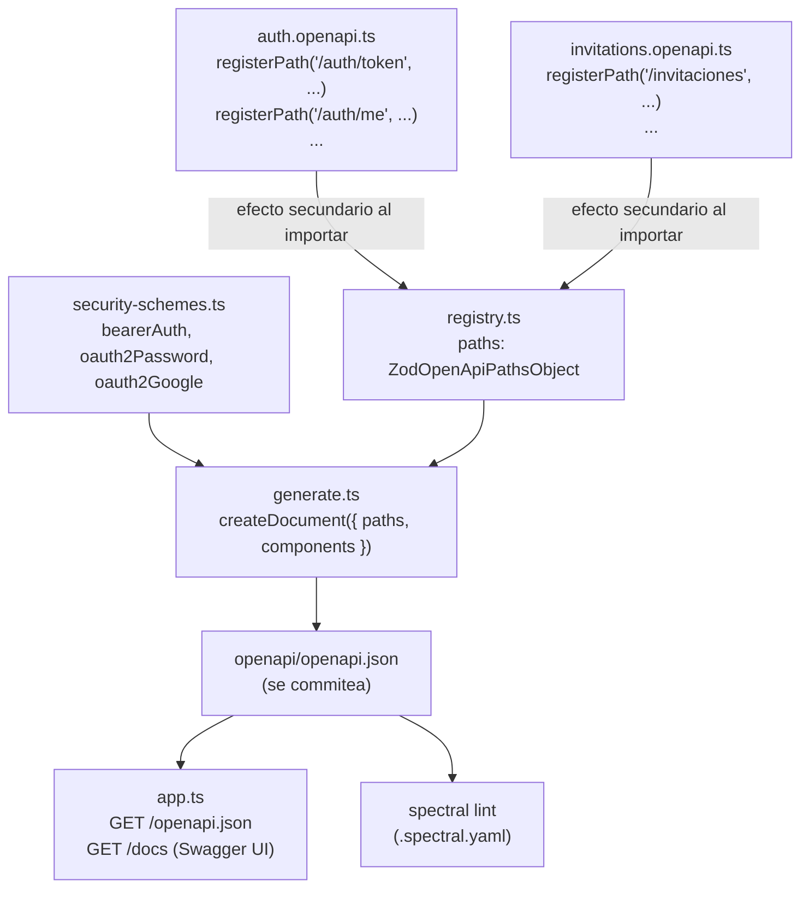

# Documentación de la API con OpenAPI

> **Ámbito de este documento**: lo implementado en **F7** del plan (`00-Plan-inicial.md`) — generación de `openapi/openapi.json` a partir de los esquemas Zod ya existentes (D4), Swagger UI en `/docs`, y lint con Spectral.
>
> **Para quién**: documento de estudio, igual que `02-Autenticacion.md`. El objetivo es entender **por qué** se documenta así, no solo copiar el patrón.

---

## Índice

1. [Qué es OpenAPI (y qué no)](#1-qué-es-openapi-y-qué-no)
2. [Code-first vs. spec-first](#2-code-first-vs-spec-first)
3. [Arquitectura: quién registra qué](#3-arquitectura-quién-registra-qué)
4. [`security-schemes.ts`: cómo se documenta la autenticación](#4-security-schemests-cómo-se-documenta-la-autenticación)
5. [`registry.ts`: el registro compartido](#5-registryts-el-registro-compartido)
6. [Anatomía de una ruta registrada](#6-anatomía-de-una-ruta-registrada)
7. [`generate.ts`: ensamblar y escribir el documento](#7-generatets-ensamblar-y-escribir-el-documento)
8. [Servir `/openapi.json` y `/docs`](#8-servir-openapijson-y-docs)
9. [Spectral: lint del documento](#9-spectral-lint-del-documento)
10. [Catálogo de lo documentado](#10-catálogo-de-lo-documentado)
11. [Lo que falta / decisiones pendientes](#11-lo-que-falta--decisiones-pendientes)
12. [Glosario](#12-glosario)

---

## 1. Qué es OpenAPI (y qué no)

**OpenAPI es un formato de datos**, no un lenguaje ni una herramienta concreta. Es una forma estándar de describir una API HTTP (rutas, métodos, esquemas de entrada/salida, autenticación, errores) como un árbol de datos que se puede escribir en **JSON o en YAML** indistintamente — son dos notaciones del mismo contenido, y cualquier herramienta del ecosistema (Swagger UI, Spectral, Insomnia, generadores de clientes) entiende ambas por igual.

Este proyecto genera **JSON** (`openapi/openapi.json`), simplemente porque Node lo serializa sin librerías extra — no hay ninguna razón técnica para preferirlo sobre YAML.

**"Swagger" y "OpenAPI" no son sinónimos exactos**: Swagger fue el nombre original de la especificación; cuando pasó a manos de la Linux Foundation se renombró a OpenAPI. "Swagger" hoy sobrevive como marca de las **herramientas** (Swagger UI, Swagger Editor), no del formato — por eso usamos `swagger-ui-express` para _mostrar_ un documento _OpenAPI_.

---

## 2. Code-first vs. spec-first

Hay dos formas de producir un documento OpenAPI (decisión D4 del plan):

| Enfoque                  | Cómo funciona                                                                                                                                                | Riesgo                                                                                                |
| ------------------------ | ------------------------------------------------------------------------------------------------------------------------------------------------------------ | ----------------------------------------------------------------------------------------------------- |
| **Spec-first**           | Escribes `openapi.yaml` a mano, como fuente de la verdad; de ahí generas stubs de servidor o clientes.                                                       | El código y el documento pueden **divergir**: cambias un campo del body y se te olvida tocar el YAML. |
| **Code-first** (elegido) | Escribes código que ya necesitabas (esquemas Zod para validar `req.body`), y una herramienta (`zod-openapi`) **genera** el documento a partir de ese código. | Ninguno de importancia: si el esquema cambia, el próximo `openapi:generate` lo refleja solo.          |

Los ficheros `.ts` que vamos a repasar (`registry.ts`, `*.openapi.ts`, `generate.ts`) **no son el documento OpenAPI** — son el programa que lo construye. El documento de verdad es el `.json` que ese programa escribe.

---

## 3. Arquitectura: quién registra qué



Principio de diseño: **cada módulo se documenta a sí mismo**. `registry.ts` no sabe nada de `auth` ni de `invitations` — solo expone un objeto compartido (`paths`) y una función (`registerPath`) para escribir en él. Cada módulo importa esa función y añade sus propias rutas. `generate.ts` es el único fichero que necesita conocer que existen `auth.openapi.ts` e `invitations.openapi.ts` — y solo para importarlos (por su efecto secundario, sin usar nada de lo que exportan).

Esto es la misma idea de capas que ya conoces de `auth`/`invitations` (routes → controller → service → repository), aplicada a documentación en vez de a lógica de negocio: bajo acoplamiento, cada pieza con una responsabilidad.

---

## 4. `security-schemes.ts`: cómo se documenta la autenticación

```ts
import type { ZodOpenApiObject } from "zod-openapi";

type SecuritySchemes = NonNullable<NonNullable<ZodOpenApiObject["components"]>["securitySchemes"]>;

export const securitySchemes: SecuritySchemes = {
  bearerAuth: { type: "http", scheme: "bearer", bearerFormat: "JWT" },
  oauth2Password: {
    type: "oauth2",
    flows: { password: { tokenUrl: "/api/v1/auth/token", scopes: {} } },
  },
  oauth2Google: {
    type: "oauth2",
    flows: {
      authorizationCode: {
        authorizationUrl: "/api/v1/auth/google",
        tokenUrl: "/api/v1/auth/google/callback",
        scopes: { openid: "...", email: "...", profile: "..." },
      },
    },
  },
};
```

- **El tipo se deriva, no se escribe a mano** (`NonNullable<NonNullable<...>>`), igual que hicimos con `DbOrTx` en `src/db/index.ts`. `components.securitySchemes` es una propiedad **opcional** en el tipo de `zod-openapi`, así que leerla da "el tipo, o `undefined`" aunque tú vayas a asignarle siempre un objeto real. El proyecto tiene `exactOptionalPropertyTypes` activado (`tsconfig.json`), que es estricto con esta distinción — de ahí el doble `NonNullable`, para quedarte solo con la parte "de verdad" del tipo.
- **Tres esquemas, tres formas de identificarse** que ya conoces de `02-Autenticacion.md`: `bearerAuth` (JWT en el header, lo que usa Swagger UI cuando pulsas "Authorize" con un token pegado a mano), y dos `oauth2` que documentan los flujos de `/auth/token` y `/auth/google` con la forma estándar de OAuth2 — aunque el intercambio real lo hace nuestro propio código, no un servidor de autorización genérico.
- **Esto no ejecuta nada**: es solo metadata que `generate.ts` incluirá en `components.securitySchemes` del documento final. Cada ruta la referencia por nombre (`security: [{ bearerAuth: [] }]`).

---

## 5. `registry.ts`: el registro compartido

```ts
import type { ZodOpenApiPathsObject } from "zod-openapi";

export const paths: ZodOpenApiPathsObject = {};

export function registerPath(path: string, definition: ZodOpenApiPathsObject[string]): void {
  paths[path] = { ...paths[path], ...definition };
}
```

Tres líneas, pero con una decisión de diseño detrás: **`paths` es un objeto mutable a nivel de módulo**, y `registerPath` lo va rellenando según se van importando los ficheros `*.openapi.ts`. Es un patrón de **registro por efecto secundario** — poco común en lógica de negocio (ahí preferimos funciones puras), pero habitual en frameworks de documentación/enrutado: cada pieza se "anuncia" al importarse, sin que un fichero central tenga que conocer de antemano la lista completa de piezas.

El `{ ...paths[path], ...definition }` en vez de `paths[path] = definition` permite que **dos módulos añadan métodos distintos a la misma ruta** sin pisarse (por ejemplo, si algún día `GET /jornadas` lo registrara un módulo y `POST /jornadas` otro). No es nuestro caso hoy, pero es gratis y evita un bug futuro.

---

## 6. Anatomía de una ruta registrada

Ejemplo real, `POST /auth/token` (`src/modules/auth/auth.openapi.ts`):

```ts
registerPath("/auth/token", {
    post: {
        operationId: "authToken",
        summary: "Obtiene tokens (password grant o refresh_token grant)",
        description: "Compatible en forma con el password grant de OAuth2 (RFC 6749)...",
        tags: ["auth"],
        requestBody: {
            required: true,
            content: {
                "application/x-www-form-urlencoded": {
                    schema: TokenRequestSchema,
                    examples: {
                        password: { summary: "Login con contraseña", value: { grant_type: "password", ... } },
                        refresh: { summary: "Renovar con refresh_token", value: { grant_type: "refresh_token", ... } },
                    },
                },
            },
        },
        responses: {
            "200": { description: "...", content: { "application/json": { schema: TokenResponseSchema, example: {...} } } },
            "400": { description: "Body mal formado o campos faltantes." },
            "401": { description: "Credenciales incorrectas o refresh token inválido/reutilizado." },
            "429": { description: "Demasiados intentos fallidos (rate limit)." },
        },
    },
});
```

- **`schema: TokenRequestSchema` es el esquema Zod real**, el mismo que usa `validate({ body: TokenRequestSchema })` en `auth.routes.ts` para validar peticiones de verdad. No hay una "segunda definición" del body en OpenAPI — es literalmente el mismo objeto. Si mañana añades un campo a `TokenRequestSchema`, aparece en la documentación en el siguiente `openapi:generate` sin tocar nada de este fichero.
- **`TokenRequestSchema` es un `z.discriminatedUnion("grant_type", [...])`** — `zod-openapi` lo convierte automáticamente en un `oneOf` de JSON Schema (lo puedes ver tal cual en `openapi/openapi.json`). No escribimos el `oneOf` a mano en ningún sitio.
- **`examples` (plural, con nombre) en el request; `example` (singular) en la respuesta**: es sintaxis de OpenAPI, no una elección nuestra — un `content` admite varios ejemplos con nombre cuando tiene sentido mostrar más de uno (aquí, las dos formas de body por `grant_type`), o uno solo sin nombre cuando basta con un caso representativo.
- **Cada respuesta de error (`400`, `401`, `429`) está documentada explícitamente**, no solo la de éxito — es lo que exige `.spectral.yaml` para las rutas con `security`, y buena práctica igualmente para las que no la llevan.
- **`"x-required-role": "admin"`** (en `invitations.openapi.ts`, para `POST /invitaciones`): OpenAPI no tiene un campo estándar para "qué rol hace falta" — `security` solo describe _cómo_ autenticarse, no _qué permiso_ se necesita una vez autenticado. Cualquier clave que empiece por `x-` es una **extensión personalizada** válida en OpenAPI 3; la usamos para documentar algo real de nuestro sistema (`requireRole('admin')`) que la especificación no contempla de fábrica.

---

## 7. `generate.ts`: ensamblar y escribir el documento

```ts
import { writeFileSync } from "node:fs";
import { createDocument } from "zod-openapi";
import "../modules/auth/auth.openapi.js";
import "../modules/invitations/invitations.openapi.js";
import { paths } from "./registry.js";
import { securitySchemes } from "./security-schemes.js";

const document = createDocument({
  openapi: "3.1.0",
  info: { title: "quini-api", version: "1.0.0", description: "..." },
  servers: [{ url: "/api/v1" }],
  tags: [
    { name: "auth", description: "..." },
    { name: "invitaciones", description: "..." },
  ],
  paths,
  components: { securitySchemes },
});

writeFileSync("openapi/openapi.json", JSON.stringify(document, null, 2) + "\n");
```

- **El orden de los imports importa**: `auth.openapi.ts` e `invitations.openapi.ts` se importan **antes** de leer `paths` — sus `registerPath(...)` tienen que haberse ejecutado ya para que `paths` esté completo cuando `createDocument` lo lea. En JavaScript/TypeScript, los imports a nivel de módulo se ejecutan en orden y de arriba a abajo la primera vez que se cargan, así que esto es determinista.
- **`tags` a nivel de documento** (no solo `tags: ["auth"]` en cada operación) es lo que exige Spectral (`operation-tag-defined`): cada tag que uses en una operación debe estar "declarado" globalmente, con su propia descripción — así Swagger UI puede agrupar las rutas por sección con un título legible.
- **`servers: [{ url: "/api/v1" }]`**: como las rutas se registran sin el prefijo (`/auth/token`, no `/api/v1/auth/token`), esto le dice a Swagger UI dónde está el servidor real para que el botón "Try it out" llame a la URL correcta.
- Es un **script, no un servidor**: se ejecuta una vez (`npm run openapi:generate`), escribe el fichero, y termina. No corre dentro de la aplicación.

---

## 8. Servir `/openapi.json` y `/docs`

En `src/app.ts`:

```ts
const openapiDocument = JSON.parse(
  readFileSync(path.join(process.cwd(), "openapi/openapi.json"), "utf-8"),
);

app.get("/openapi.json", (_req, res) => {
  res.json(openapiDocument);
});

app.use(
  "/docs",
  swaggerUi.serve,
  swaggerUi.setup(openapiDocument, {
    swaggerOptions: { persistAuthorization: true },
  }),
);
```

- **Se lee una sola vez, al arrancar la app**, no en cada petición — `openapi.json` es un artefacto generado y commiteado, no algo que cambie mientras el servidor corre. Si regeneras el documento con la app ya arrancada, hace falta reiniciarla para que recoja el cambio (`tsx --watch` no vigila ese fichero, solo el código fuente).
- **`path.join(process.cwd(), ...)` en vez de una ruta relativa al propio fichero**: funciona igual en desarrollo (`tsx` desde `src/`) y en un build de producción (`node dist/src/server.js`), siempre que el proceso arranque desde la raíz del repo — evita el problema de que `import.meta.url` apunte a sitios distintos según si el código vive en `src/` o en `dist/src/`.
- **`persistAuthorization: true`**: sin esto, cada recarga de `/docs` te obligaría a pegar el token otra vez. Con esto, Swagger UI lo recuerda en el navegador entre recargas — cómodo para probar varios endpoints seguidos.

---

## 9. Spectral: lint del documento

`.spectral.yaml`:

```yaml
extends: ["spectral:oas"]

rules:
  info-contact: off
  operation-tags: warn

  operation-must-have-example:
    given: "$.paths[*][*].responses[?(@property >= '200' && @property < '300')].content[*]"
    severity: warn
    then:
      function: schema
      functionOptions:
        schema: { type: object, anyOf: [{ required: ["example"] }, { required: ["examples"] }] }

  secured-operation-must-declare-401:
    given: "$.paths[*][*][?(@.security)]"
    severity: error
    then:
      field: responses.401
      function: truthy
```

- **`extends: ["spectral:oas"]`** trae de fábrica buena parte de lo que pide el plan: `operationId` único y obligatorio, `description` no vacía en cada operación, tags declarados globalmente, etc. No reinventamos reglas que Spectral ya trae.
- **Dos reglas propias, escritas con JSONPath** (`given: "$.paths[*][*]..."`): Spectral no entiende tu API, solo sabe recorrer el árbol JSON del documento y aplicar una comprobación (`then`) a cada nodo que encuentre una expresión JSONPath. `secured-operation-must-declare-401` busca cualquier operación (`$.paths[*][*]`) que tenga un campo `security` truthy, y exige que su `responses.401` también sea truthy — así de simple, y es exactamente la regla que pide el plan.
- **Solo `401` se fuerza por regla; `403` se deja a criterio manual**: no todas las rutas con `security` requieren un rol concreto (`requireAuth` sin `requireRole` no puede dar 403), así que forzar `403` en todas por regla daría falsos positivos. Donde sí aplica (`POST /invitaciones`, los callbacks de Google), está declarado a mano.
- `npm run openapi:lint` da **0 errores, algunos avisos** aceptables (p. ej. `operation-tags: warn` en vez de `error`, porque no es crítico si algún día se te olvida un tag en una ruta nueva).

---

## 10. Catálogo de lo documentado

| Módulo                   | Rutas documentadas                                                                                                                                                                 |
| ------------------------ | ---------------------------------------------------------------------------------------------------------------------------------------------------------------------------------- |
| `auth.openapi.ts`        | `POST /auth/token`, `POST /auth/revoke`, `POST /auth/logout`, `GET /auth/me`, `POST /auth/register`, `GET /auth/google`, `GET /auth/google/callback`, `POST /auth/google/id-token` |
| `invitations.openapi.ts` | `POST /invitaciones`, `GET /invitaciones/{token}/validar`                                                                                                                          |

Las diez rutas de F4-F6 quedan documentadas y son ejecutables desde `/docs` con autorización Bearer persistente.

---

## 11. Lo que falta / decisiones pendientes

- **`GET /health` no está documentado**: es un endpoint de infraestructura (para checks de salud, no parte del contrato de negocio), se deja fuera a propósito.
- **Sin CI que compruebe que `openapi.json` está actualizado**: hoy depende de acordarse de correr `npm run openapi:generate` tras cambiar un esquema. Un paso de CI que regenere y compare contra el commiteado (fallando si hay diferencia) cerraría ese hueco — pendiente para cuando exista pipeline de CI.
- **`temporadas`/`jornadas`/`equipos` (F10, F10.5, F11) no existen todavía**, así que tampoco están documentados — se añadirán con su propio `*.openapi.ts` cuando se construyan, siguiendo exactamente este mismo patrón.
- **Nuevas rutas futuras necesitan acordarse de tres cosas**: registrar el path en su propio `*.openapi.ts`, declarar `401`/`403` si llevan `security`, y añadir un `example` en sus respuestas 2xx — si no, Spectral lo señala (como aviso o como error, según la regla).

---

## 12. Glosario

- **OpenAPI**: formato estándar (JSON o YAML) para describir una API HTTP. No es una herramienta ni un framework, es una estructura de datos con una especificación formal.
- **Swagger UI**: una de las herramientas del ecosistema OpenAPI — renderiza un documento OpenAPI como una página web navegable y ejecutable ("Try it out"). "Swagger" es el nombre histórico de la especificación antes de renombrarse a OpenAPI; hoy sobrevive como marca de herramientas.
- **JSON Schema**: el sub-formato que OpenAPI usa para describir la forma de los datos (`schema` en cada `content`). Es lo que `zod-openapi` genera automáticamente a partir de cada esquema Zod.
- **`oneOf`**: palabra clave de JSON Schema para "el valor debe cumplir exactamente uno de estos esquemas" — es la traducción directa de un `z.discriminatedUnion(...)` de Zod.
- **Code-first vs. spec-first**: dos formas de producir un documento OpenAPI. Code-first (la elegida aquí) lo genera desde el código real (esquemas Zod); spec-first lo escribe a mano como fuente de la verdad y genera código a partir de él.
- **Extensión `x-` (vendor extension)**: cualquier campo cuyo nombre empiece por `x-` en un documento OpenAPI; es el mecanismo oficial para añadir información propia que la especificación no contempla (aquí, `x-required-role`).
- **JSONPath**: lenguaje de consultas sobre estructuras JSON (`$.paths[*][*]...`), usado por Spectral para seleccionar qué partes del documento comprobar en cada regla.
