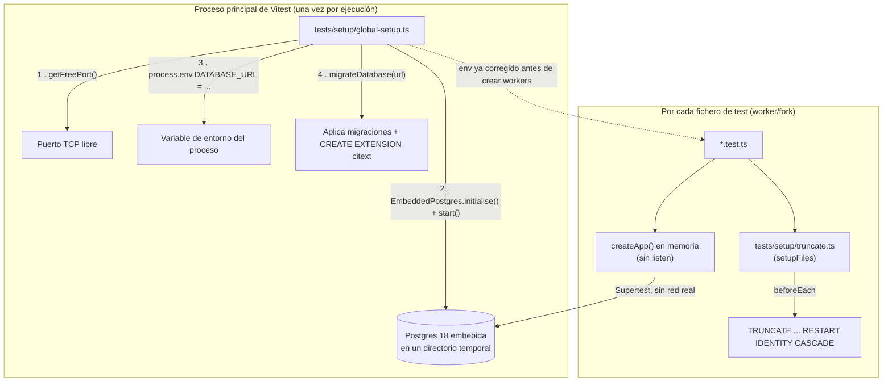

# Testing automatizado

> **Ámbito de este documento**: lo implementado en **F8** del plan (`00-Plan-inicial.md`) — la suite de tests automatizados (Vitest + Supertest) sobre los módulos `auth` e `invitations` (F4/F5/F6), con Postgres real embebida y validación de contrato contra el OpenAPI de F7.
>
> **Para quién**: documento de estudio, complementario a `02-Autenticacion.md` y `03-OpenAPI.md`. El objetivo no es solo listar "qué tests hay", sino **por qué** están construidos así, qué decisiones de diseño hay detrás, y qué se ha dejado fuera a propósito.

---

## Índice

1. [La pirámide de testing](#1-la-pirámide-de-testing)
2. [Arquitectura: Postgres real, sin Docker](#2-arquitectura-postgres-real-sin-docker)
3. [Aislamiento entre tests](#3-aislamiento-entre-tests)
4. [Helpers de test](#4-helpers-de-test)
5. [Contract testing contra el OpenAPI](#5-contract-testing-contra-el-openapi)
6. [La batería mínima de 7 casos](#6-la-batería-mínima-de-7-casos)
7. [Catálogo de tests escritos](#7-catálogo-de-tests-escritos)
8. [Cobertura: umbrales y números reales](#8-cobertura-umbrales-y-números-reales)
9. [Qué se excluye de los tests, y por qué](#9-qué-se-excluye-de-los-tests-y-por-qué)
10. [Bugs reales que aparecieron al escribir los tests](#10-bugs-reales-que-aparecieron-al-escribir-los-tests)
11. [Cómo ejecutar los tests](#11-cómo-ejecutar-los-tests)
12. [Lo que falta / decisiones pendientes](#12-lo-que-falta--decisiones-pendientes)
13. [Glosario](#13-glosario)

---

## 1. La pirámide de testing

El plan (§13) propone cuatro niveles, cada uno con un objetivo distinto:

| Nivel           | Qué prueba                                                | Herramienta        | BD            | Objetivo                                              |
| --------------- | --------------------------------------------------------- | ------------------ | ------------- | ----------------------------------------------------- |
| **Unit**        | Lógica pura, sin red ni BD                                | Vitest             | No            | Rápido, muchos casos borde                            |
| **Integración** | Endpoint completo: HTTP → middleware → service → SQL real | Vitest + Supertest | **Sí (real)** | Donde aparecen los bugs de verdad                     |
| **Contrato**    | La respuesta real cumple el esquema del OpenAPI           | ajv                | Sí            | La documentación no miente                            |
| **Humo (e2e)**  | La colección de Insomnia pasa contra la app arrancada     | `inso run test`    | Sí            | El camino del cliente real (F9, ver `05-Insomnia.md`) |

Este proyecto usa sobre todo el nivel de **integración**: la inmensa mayoría de los tests montan la `app` de Express en memoria (sin escuchar en un puerto real) y le hacen peticiones HTTP de verdad con Supertest, contra una base de datos Postgres real. Solo dos casos concretos son estrictamente **unitarios** (sin HTTP): `loginWithGoogle` y las funciones puramente locales de `google.ts` — se explica el porqué en la [§9](#9-qué-se-excluye-de-los-tests-y-por-qué).

**Por qué integración y no unit-test-con-mocks como enfoque principal**: mockear el repositorio o la base de datos oculta exactamente la clase de bugs que más duelen en producción — una consulta SQL mal escrita, una transacción que no hace rollback, un índice único que no se comporta como crees. Un test que mockea `db.insert(...)` para que siempre "funcione" no habría detectado, por ejemplo, el bug real de `isUniqueViolation` que se describe en la [§10](#10-bugs-reales-que-aparecieron-al-escribir-los-tests) — ese bug solo se manifiesta contra un Postgres real, con una restricción `UNIQUE` real, lanzando un error real de `pg`.

---

## 2. Arquitectura: Postgres real, sin Docker



- **`embedded-postgres`** arranca un binario de Postgres **de verdad** (misma versión que producción y Docker, `18.4.0-beta.17`, decisión Q10 del plan) en un puerto libre y un directorio temporal, sin Docker ni ningún servicio externo. `npm test` funciona igual con Docker parado que arrancado — es completamente autocontenido.
- **`global-setup.ts`** se ejecuta **una sola vez** para toda la ejecución (no por fichero), en el proceso principal de Vitest, **antes** de que se creen los procesos worker que realmente corren los tests. Arranca la BD, la migra, y corrige `process.env.DATABASE_URL` para que apunte a ella — como esto ocurre antes de crear los workers, estos heredan la variable ya corregida desde su nacimiento.
- **Lección aprendida (y no trivial) sobre este punto**: `vitest.config.ts` **debe** vivir en la raíz del repositorio, no en `src/` ni en ningún subdirectorio — Vitest solo lo busca en el directorio desde el que se ejecuta. Si no lo encuentra, arranca con la configuración por defecto **sin avisar de nada**: sin `globalSetup`, sin `pool: "forks"`, sin umbrales de cobertura — y los tests fallan con errores de conexión que no tienen pinta de ser "el fichero de configuración está mal puesto". Fue la causa real de buena parte del tiempo de depuración de esta fase.
- **`migrate.ts`** (`src/db/migrate.ts`) es una utilidad **separada** del `db/index.ts` de la aplicación: crea su propio `Pool` a partir de una URL que recibe como parámetro (no lee `env.DATABASE_URL`), porque necesita migrar una base de datos cuya URL solo se conoce en tiempo de ejecución (puerto elegido al vuelo). Además ejecuta `CREATE EXTENSION IF NOT EXISTS citext` — en Docker esa extensión la crea `docker/initdb/01-extensions.sql`, pero la Postgres embebida no tiene ese hook de arranque, así que hay que crearla explícitamente antes de migrar.
- **`pool: "forks"` + `fileParallelism: false`**: cada fichero de test corre en su propio proceso hijo (no hilos, procesos reales — necesario porque el driver nativo de Postgres no es seguro entre hilos), y los ficheros se ejecutan **secuencialmente**, no en paralelo. Es más lento que correr todo en paralelo, pero evita que dos ficheros se pisen escribiendo en la misma base de datos compartida al mismo tiempo.

---

## 3. Aislamiento entre tests

```ts
// tests/setup/truncate.ts
beforeEach(async () => {
  await db.execute(sql`
        TRUNCATE TABLE
            partidos, jornadas, equipos, temporadas,
            oauth_accounts, refresh_tokens, invitations, users
        RESTART IDENTITY CASCADE
    `);
});
```

- **Una base de datos por ejecución, no por test**: arrancar Postgres es lo caro (aunque sea embebida, sigue siendo un proceso real); crear y destruir una BD por cada uno de los 45 tests sería mucho más lento sin aportar nada.
- **`TRUNCATE ... RESTART IDENTITY CASCADE` antes de cada test**, en vez de la alternativa más elegante de envolver cada test en una transacción con `ROLLBACK` al final: esa alternativa es más rápida, pero es incompatible con código que abre sus propias transacciones — y este proyecto las abre (`registerWithInvitation`, `loginWithGoogle`, ambos usan `db.transaction(...)`). `TRUNCATE` es más simple y funciona siempre, a costa de ser algo más lento.
- **`RESTART IDENTITY`**: aunque las tablas de este proyecto usan `uuidv7()` como clave primaria (no autoincrementales), esta cláusula no hace daño y deja el `TRUNCATE` preparado por si algún día se añade una tabla con secuencia.
- **`CASCADE`**: necesario porque hay claves foráneas entre tablas (`refresh_tokens.user_id → users.id`, etc.) — sin `CASCADE`, Postgres rechazaría truncar `users` mientras existan filas en `refresh_tokens` que la referencian.

---

## 4. Helpers de test

`tests/helpers/auth.ts` centraliza las formas de "estar autenticado" en un test, **por orden de preferencia** (plan §13):

| Helper                           | Cómo funciona                                                       | Cuándo usarlo                                                     |
| -------------------------------- | ------------------------------------------------------------------- | ----------------------------------------------------------------- |
| `authHeader(user)`               | Firma un JWT directamente con `signAccessToken`, sin HTTP ni Argon2 | El 90% de los tests: solo necesitas "estar autenticado como X"    |
| `loginAs(email, password)`       | Hace `POST /auth/token` de verdad, con Argon2 real                  | Tests que prueban **el propio login**                             |
| `createUser()` / `createAdmin()` | Insertan el usuario directamente en BD (vía `auth.repository.ts`)   | Preparar datos antes de un test, sin que el coste sea el objetivo |

Además, tres funciones fabrican **tokens deliberadamente inválidos** para la batería de casos negativos, duplicando a propósito parte de la lógica de `tokens.ts` (con la clave secreta real, pero con parámetros que `signAccessToken` no permite personalizar):

- `expiredToken(user)` — mismo secreto, `exp` ya pasado.
- `tokenSignedWithOtherKey(user)` — firmado con una clave distinta a la de la app.
- `tokenWithWrongAudience(user)` — firma válida, pero `aud` distinta a `env.JWT_AUDIENCE`.

Son tres fallos con causas distintas (firma inválida vs. claims que no encajan vs. caducidad), y por eso el plan los separa en filas distintas de la batería — un solo "token roto genérico" no distinguiría cuál de las tres comprobaciones de `verifyAccessToken` está realmente funcionando.

`tests/helpers/openapi.ts` implementa el nivel de **contrato**: valida la respuesta real de un endpoint contra el `openapi/openapi.json` generado en F7, usando `ajv` (con soporte para JSON Schema 2020-12, el dialecto que usa OpenAPI 3.1) más `ajv-formats` (para que las palabras clave `format: "email"`, `"uuid"`, `"date-time"` se comprueben de verdad). La parte más delicada es resolver el `$ref` interno al documento completo mediante un JSON Pointer, en vez de compilar el fragmento de schema suelto — así, si algún día dos endpoints compartieran un schema reutilizable vía `components`, seguiría resolviéndose correctamente.

---

## 5. Contract testing contra el OpenAPI

Cada vez que un test de éxito (2xx) comprueba una respuesta, además de las aserciones normales (`expect(response.status).toBe(200)`, etc.) se llama a `expectMatchesOpenApiSchema`:

```ts
expectMatchesOpenApiSchema({
  path: "/auth/token",
  method: "post",
  status: 200,
  body: response.body,
});
```

Dos matices importantes:

- **`path` es la clave del `openapi.json`, no la URL real de la petición**. Como `servers: [{ url: "/api/v1" }]` en `src/openapi/generate.ts`, las claves de `paths` son `"/auth/token"`, mientras que Supertest llama de verdad a `"/api/v1/auth/token"` — son dos rutas distintas por diseño, y hay que usarlas cada una en su sitio.
- **Las rutas con parámetro llevan la llave literal**: `path: "/invitaciones/{token}/validar"`, tal cual aparece en el `openapi.json`, no con el token real sustituido.

Este nivel de test responde a una pregunta que los tests de integración normales no responden por sí solos: **¿la documentación que generamos en F7 sigue describiendo lo que la API realmente devuelve?** Si alguien cambia un campo de una respuesta sin regenerar el OpenAPI (o al revés), este test lo detecta.

---

## 6. La batería mínima de 7 casos

Plantilla reutilizable del plan (§13) para cualquier endpoint autenticado:

| #   | Caso                                   | Esperado           |
| --- | -------------------------------------- | ------------------ |
| 1   | Sin cabecera `Authorization`           | `401 UNAUTHORIZED` |
| 2   | `Bearer basura`                        | `401`              |
| 3   | Token expirado (`exp` pasado)          | `401`              |
| 4   | Token firmado con otra clave           | `401`              |
| 5   | Token con `aud`/`iss` incorrectos      | `401`              |
| 6   | Token de `user` en endpoint de `admin` | `403 FORBIDDEN`    |
| 7   | Token de `admin` correcto              | `2xx`              |

Se aplicó completa (los 7 casos) en `POST /api/v1/invitaciones` (`tests/integration/invitations-create.test.ts`), porque es el único endpoint de los dos módulos que combina `requireAuth` **y** `requireRole("admin")` — es el sitio natural para probar el 403 de rol. En `GET /api/v1/auth/me` (`tests/integration/auth.me.test.ts`) se aplican los casos 1-5 y 7, sin el 6, porque esa ruta no exige ningún rol concreto: cualquier usuario autenticado puede llamarla.

Es intencionadamente repetitiva entre ficheros — el propio plan lo describe como "mecánico, y siempre se olvida alguno" (§14): la repetición aquí es la garantía de que **cada** endpoint protegido se comprueba con exactamente los mismos 7 ángulos, no una versión abreviada a discreción de quien escribe el test.

---

## 7. Catálogo de tests escritos

| Fichero                                          | Qué cubre                                                                                              |
| ------------------------------------------------ | ------------------------------------------------------------------------------------------------------ |
| `tests/integration/auth.me.test.ts`              | Batería de 7 casos (sin el 403) sobre `GET /auth/me`                                                   |
| `tests/integration/auth-token-password.test.ts`  | `loginWithPassword`: éxito, contraseña incorrecta, email no registrado, usuario solo-Google            |
| `tests/integration/auth-token-refresh.test.ts`   | `refresh`: rotación, token desconocido, token expirado, detección de reuso y revocación de familia     |
| `tests/integration/auth-revoke-logout.test.ts`   | `revoke` (con token válido/inexistente/ya revocado) y `logout` (revoca todas las sesiones)             |
| `tests/integration/auth-register.test.ts`        | `registerWithInvitation`: éxito, token inexistente, ya usado, revocado, caducado                       |
| `tests/integration/invitations-create.test.ts`   | Batería completa de 7 casos sobre `POST /invitaciones` (incluye el 403 de rol)                         |
| `tests/integration/invitations-validate.test.ts` | `validate()` de invitaciones (válida/inexistente/usada) + el 409 de invitación pendiente duplicada     |
| `tests/integration/error-handling.test.ts`       | `error-handler.ts`: error de validación Zod, JSON malformado en el body                                |
| `tests/unit/auth-service-google.test.ts`         | `loginWithGoogle` de punta a punta (unitario, sin HTTP): las 4 ramas reales de negocio                 |
| `tests/unit/google.test.ts`                      | `createAuthorizationRequest` (PKCE/URL) y `extractProfile`, las dos partes de `google.ts` sin red real |

45 tests en total, repartidos en 10 ficheros.

---

## 8. Cobertura: umbrales y números reales

Configurado en `vitest.config.ts`:

```ts
coverage: {
    provider: "v8",
    reporter: ["text", "html"],
    thresholds: {
        lines: 80,
        statements: 80,
        branches: 80,
        functions: 80,
        "src/modules/auth/auth.service.ts": { 100: true },
        "src/modules/invitations/invitations.service.ts": { 100: true },
    },
},
```

- **80% global**: suficiente para que un cambio que rompa algo importante salte a la vista, sin perseguir el último 20% en ficheros de bajo riesgo (esquemas de Drizzle, configuración, capas de infraestructura como `app.ts`).
- **100% en `auth.service.ts` e `invitations.service.ts`**: son los dos ficheros que concentran **toda** la lógica de negocio de seguridad — verificación de contraseñas, rotación de tokens, detección de reuso, invitaciones de un solo uso. Un umbral más laxo ahí sería aceptar que una rama de seguridad sin probar es tolerable, y no lo es.

Resultado tras la última ejecución (`npm run test:cov`):

| Ámbito                                           | Líneas | Ramas  | Funciones | Sentencias |
| ------------------------------------------------ | ------ | ------ | --------- | ---------- |
| Global                                           | 91.36% | 83.46% | 85.04%    | 90.14%     |
| `src/modules/auth/auth.service.ts`               | 100%   | 100%   | 100%      | 100%       |
| `src/modules/invitations/invitations.service.ts` | 100%   | 100%   | 100%      | 100%       |

---

## 9. Qué se excluye de los tests, y por qué

No toda línea sin cubrir es un descuido — hay dos categorías distintas de exclusión consciente, y merece la pena distinguirlas:

### 9.1. El intercambio real con Google (`exchangeCodeForProfile`, `verifyGoogleIdToken`)

```ts
/* v8 ignore start -- @preserve */
export async function exchangeCodeForProfile(
  code: string,
  codeVerifier: string,
): Promise<GoogleProfile> {
  // ...
}

export async function verifyGoogleIdToken(idToken: string): Promise<GoogleProfile> {
  // ...
}
/* v8 ignore stop -- @preserve */
```

Estas dos funciones hacen una llamada HTTPS real al endpoint de tokens de Google y verifican la firma de un `id_token` contra las claves públicas **reales** de Google (descargadas por red). No se pueden probar de forma honesta en un test automático:

- El `code` de autorización solo lo emite Google cuando una persona real pasa por su pantalla de consentimiento en un navegador — de un solo uso, caduca en minutos, no se puede generar por script.
- No existe forma de fabricar un `id_token` válido nosotros mismos: no tenemos la clave privada de Google para firmarlo (y si la tuviéramos, todo el sistema dejaría de ser seguro).
- La alternativa sería sustituir `OAuth2Client` por un doble/mock — pero entonces el test solo comprobaría "¿mi código llama al mock como yo creo que se comporta la librería real?", no la integración real. Si Google cambia algo o se malinterpretó el contrato de la librería, el mock seguiría "pasando" mientras la integración real está rota.

**Lo que sí se prueba** en su lugar es `loginWithGoogle` (en `auth.service.ts`), que es el código **propio** que decide qué hacer con el resultado que Google ya entregó (vincular cuenta, exigir invitación, rechazar) — ahí sí hay lógica de negocio nuestra que proteger, y se prueba con un objeto `GoogleProfile` de mentira, sin tocar la red. Y de `google.ts` sí se prueban directamente las dos funciones que **no** dependen de la red: `createAuthorizationRequest` (generación de PKCE y construcción de la URL, puramente local) y `extractProfile` (la validación de `email_verified`/`email`, pura lógica sobre un objeto ya recibido).

**El coste real de esta exclusión, dicho sin adornos**: si algún día se rompe algo dentro de `exchangeCodeForProfile` (un típo leyendo un campo de la respuesta de Google, por ejemplo), `npm test` no lo va a detectar — solo se vería probando el login de Google a mano (como se hizo al cerrar F6) o en producción. Es una renuncia consciente, no gratuita.

### 9.2. Ramas defensivas genuinamente inalcanzables

Tres líneas de código real de negocio están marcadas con `/* v8 ignore next -- @preserve */`, no porque no importen, sino porque **no pueden ejecutarse** dado el resto del diseño:

| Fichero           | Rama ignorada                                                        | Por qué es inalcanzable                                                                                                                                                   |
| ----------------- | -------------------------------------------------------------------- | ------------------------------------------------------------------------------------------------------------------------------------------------------------------------- |
| `auth.service.ts` | `refresh()`: `if (!user)` tras encontrar el token                    | `refresh_tokens.user_id` tiene `onDelete: cascade` — si se borra el usuario, sus refresh tokens desaparecen con él, así que nunca puede existir un token vivo sin usuario |
| `auth.service.ts` | `loginWithGoogle()`: `if (!user)` tras encontrar la cuenta vinculada | Mismo motivo: `oauth_accounts.user_id` también tiene `onDelete: cascade`                                                                                                  |
| `tokens.ts`       | `verifyAccessToken()`: JWT sin claim `sub`                           | El propio `signAccessToken` siempre llama a `.setSubject(user.id)` — ningún JWT que este sistema emite carece de `sub`                                                    |

Y dos más, dentro de `invitations.service.ts`, en el manejo de errores de `create()`:

```ts
function isUniqueViolation(err: unknown): boolean {
  /* v8 ignore next -- @preserve */
  const cause = err instanceof Error ? err.cause : undefined;
  // ...
}
```

El `else` de `err instanceof Error` (un valor lanzado que no sea una instancia real de `Error`) y el `throw err;` cuando el fallo de base de datos **no** es una violación de unicidad son, en la práctica, imposibles de disparar sin fabricar artificialmente un error de un tipo que ni `pg` ni Drizzle producen nunca.

**Por qué marcarlas explícitamente en vez de dejarlas simplemente sin cubrir**: sin el comentario, cada vez que se revise la cobertura habría que volver a investigar por qué esa línea concreta no llega al 100% y concluir, otra vez, que es inalcanzable. El comentario dice de una vez para siempre "esto se pensó, y la conclusión fue esta" — la alternativa (bajar el umbral del fichero a un 95% arbitrario) escondería la razón real detrás de un número.

**Detalle de Vitest/esbuild que hay que recordar si se añaden más**: el comentario debe llevar el sufijo `-- @preserve`, o esbuild lo elimina durante la transpilación de TypeScript y deja de tener efecto — no basta con `/* v8 ignore next */` a secas.

---

## 10. Bugs reales que aparecieron al escribir los tests

Escribir esta suite no fue solo "confirmar que todo funciona" — destapó varios problemas reales que llevaban tiempo en el código sin que nadie los notara:

- **`invitations.routes.ts` registraba dos veces la misma ruta**: `GET /:token/validar` aparecía una vez sin `invitationRateLimit` y otra vez con él. Express usa siempre el primer registro que coincide, así que el rate limit de ese endpoint llevaba tiempo sin aplicarse en la práctica, sin ningún error visible.
- **`isUniqueViolation` (en `invitations.service.ts`) llevaba tiempo sin detectar nunca una violación de unicidad real**: comprobaba `err.code === "23505"` directamente, pero desde Drizzle ORM `>= 0.44`, todos los errores del driver se envuelven en un `DrizzleQueryError` propio, y el error original de `pg` (con el código SQLSTATE) queda colgado de `.cause`, no en la raíz. El resultado era que un intento de invitar dos veces al mismo email devolvía `500 INTERNAL_ERROR` en vez de `409 CONFLICT` — un test end-to-end lo detectó inmediatamente porque esperaba `409` y recibió `500`.
- **`google-auth-library` no era una dependencia real del proyecto**: no estaba en `package.json` ni en `package-lock.json`. Node la resolvía "de prestado" desde un `node_modules` ajeno, fuera del repositorio, en el directorio personal de usuario — la aplicación funcionaba por pura casualidad en esa máquina concreta, y habría fallado al arrancar en cualquier otro sitio (otro ordenador, CI, un servidor de producción) nada más ejecutar un `npm install` limpio. Se detectó al intentar consultar el tipo `TokenPayload` de la librería para escribir un test, no por un fallo directo de `npm test` — un recordatorio de que "los tests pasan" no es lo mismo que "las dependencias están bien declaradas".

Ninguno de estos tres bugs se habría encontrado con una suite basada en mocks — los tres dependen de comportamiento real (una ruta real de Express, un error real de Postgres, una resolución real de módulos de Node).

---

## 11. Cómo ejecutar los tests

```bash
npm test          # una ejecución, sin watch (usada en CI)
npm run test:watch # modo interactivo, re-ejecuta al guardar
npm run test:cov  # una ejecución + informe de cobertura (text + html en coverage/)
```

Los tres comandos cargan `.env.test` explícitamente (`node --env-file=.env.test ...`), nunca `.env` — así los tests nunca dependen de que tengas Docker levantado ni de tu configuración local de desarrollo. `.env.test` se commitea (no tiene secretos reales: ni `JWT_SECRET` ni las credenciales de Google son válidas para nada fuera de esta suite).

---

## 12. Lo que falta / decisiones pendientes

- **`temporadas`/`jornadas`/`equipos` (F10, F10.5, F11) no tienen tests todavía** — esos módulos ni siquiera existen aún en el código; `tests/helpers/factories.ts`, previsto en el plan para esos módulos, se dejó sin crear a propósito hasta que exista algo que fabricar.
- **`POST /auth/google/id-token` no tiene test de integración vía HTTP**, solo la lógica de negocio compartida (`loginWithGoogle`) probada de forma unitaria — coherente con la decisión de no mockear la verificación de Google, pero sigue siendo una ruta sin ejercitar de punta a punta.
- **El 500 genérico de `error-handler.ts` (el `catch-all` final) no tiene test**: forzar un error verdaderamente inesperado (ni `AppError`, ni `ZodError`, ni `SyntaxError` de JSON) sin mockear una dependencia no tiene una vía limpia con el enfoque de esta suite.
- **F9 (Insomnia/smoke test) ya está cerrado** — colección importada, helper de OAuth2 y entornos de rol funcionando, exportada y versionada. Detalles y la chuleta de problemas de la UI en `docs/05-Insomnia.md`. Queda pendiente, de baja prioridad, duplicar el helper con Authorization Code + PKCE para probar el login con Google desde el propio cliente.

---

## 13. Glosario

- **Test de integración**: prueba que ejercita varias capas juntas de verdad (HTTP → middleware → service → SQL), en vez de aislar una función con dependencias falsas.
- **Contract testing**: comprobar que la respuesta real de un endpoint cumple el esquema publicado en su documentación (aquí, el OpenAPI), para detectar cuando el código y la documentación se desincronizan.
- **Postgres embebida**: un binario real de Postgres, controlado programáticamente desde Node (arrancar, crear BD, parar), sin necesitar Docker ni un servicio externo — usado aquí solo para tests.
- **`globalSetup` vs. `setupFiles` (Vitest)**: `globalSetup` corre una vez para toda la ejecución, en el proceso principal; `setupFiles` corre una vez por cada fichero de test, dentro de su propio proceso — sirven para cosas distintas y no son intercambiables.
- **Aislamiento entre tests**: garantizar que lo que un test escribe en la base de datos no afecta al resultado de otro test — aquí, vía `TRUNCATE` antes de cada uno.
- **Rama de cobertura inalcanzable**: código real que existe por seguridad/defensividad pero que, dado el resto del diseño (por ejemplo, una restricción `ON DELETE CASCADE`), nunca puede llegar a ejecutarse por un camino legítimo.
- **`v8 ignore` (Vitest)**: comentario que marca una línea o bloque como excluido a propósito del cálculo de cobertura, documentando la razón en vez de simplemente bajar el umbral exigido.
