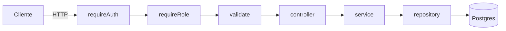
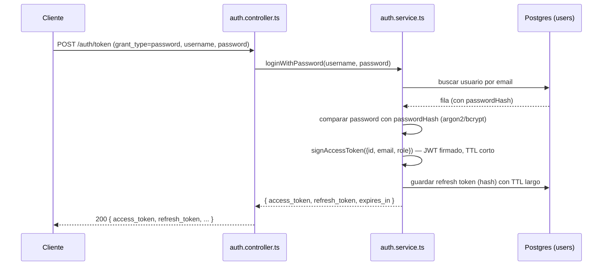
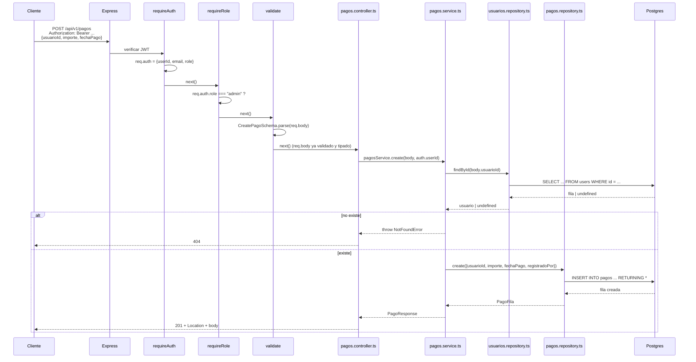
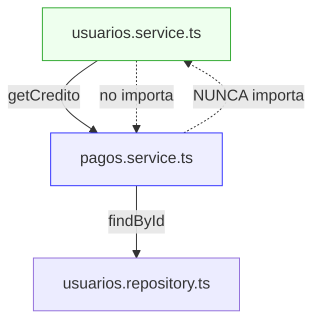
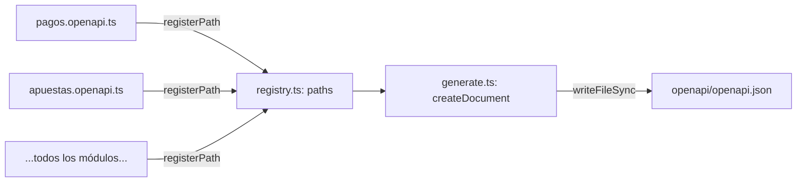
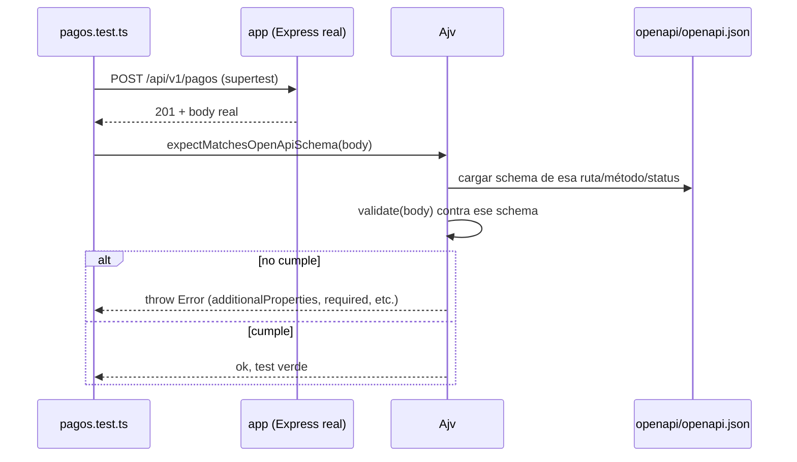

# 08 — El servicio `pagos`, paso a paso

> Documento de aprendizaje, no de especificación. Usa `pagos` (F20) como caso de estudio para explicar, de punta a punta, cómo está construido **cualquier** módulo de esta API: autenticación, capas, OpenAPI y tests. Todo lo que se explica aquí aplica igual a `resultados`, `apuestas`, `calculos`, etc. — `pagos` se eligió porque es el módulo más pequeño y ya está cerrado.

Todas las rutas de `pagos` cuelgan de `/api/v1/pagos` (montado en `src/routes.ts`). Los ficheros del módulo viven en `src/modules/pagos/`:

```
pagos.ts            (en src/db/schema/)  — la tabla en Postgres
pagos.schemas.ts     — validación y tipos (Zod)
pagos.repository.ts  — lee/escribe en Postgres (Drizzle)
pagos.service.ts     — reglas de negocio
pagos.controller.ts  — adapta Express a las funciones del service
pagos.routes.ts      — cablea middlewares + controller a URLs
pagos.openapi.ts      — describe el contrato para Swagger/tests
```

---

## 1. El mapa mental: una petición, seis paradas

Antes de entrar en detalle, esta es la ruta que recorre **cualquier** petición HTTP en esta API, de fuera hacia dentro:



- **`requireAuth`** y **`requireRole`** son middlewares de Express: deciden si la petición puede continuar, sin tocar lógica de negocio.
- **`validate`** convierte `req.body`/`req.params`/`req.query` en datos ya validados y tipados (Zod).
- **`controller`** es la única capa que conoce `Request`/`Response` de Express — traduce HTTP a llamadas de función normales.
- **`service`** contiene las reglas de negocio (qué está permitido, qué lanza qué error).
- **`repository`** es la única capa que conoce Drizzle/SQL — el service nunca escribe SQL directamente.

Cada capa solo habla con la de al lado. El `controller` nunca toca Drizzle; el `repository` nunca lanza `ForbiddenError`. Esta separación es la que hace que cada pieza se pueda entender (y testear) por separado.

---

## 2. Autenticación y autorización

### 2.1 Cómo se consigue un token

Un cliente no manda usuario/contraseña en cada petición: los cambia una vez por un **access token** (JWT) y un **refresh token**, en `POST /auth/token`.



El **access token** es un JWT firmado con `HS256` (`src/modules/auth/tokens.ts`):

```ts
export async function signAccessToken(user: AccessTokenSubject): Promise<string> {
  return new SignJWT({ email: user.email, role: user.role })
    .setProtectedHeader({ alg: "HS256" })
    .setSubject(user.id) // el "sub" del JWT es el userId
    .setIssuer(env.JWT_ISSUER)
    .setAudience(env.JWT_AUDIENCE)
    .setIssuedAt()
    .setExpirationTime(env.ACCESS_TOKEN_TTL)
    .sign(secret);
}
```

Dentro del JWT (una vez decodificado) va: `sub` (el `userId`), `email`, `role`, más `iss`/`aud`/`iat`/`exp`. **No** lleva contraseñas ni nada sensible — es información pública una vez el cliente tiene el token, solo protegida por la firma.

### 2.2 Cómo se verifica en cada petición protegida

El cliente manda el token en la cabecera `Authorization: Bearer <token>`. El middleware `requireAuth` (`src/middleware/require-auth.ts`) lo verifica:

```ts
export async function requireAuth(req: Request, _res: Response, next: NextFunction): Promise<void> {
  const header = req.header("authorization");
  if (!header || !header.startsWith("Bearer ")) throw new UnauthorizedError();

  const token = header.slice("Bearer ".length);
  try {
    req.auth = await verifyAccessToken(token); // <- valida firma, issuer, audience, expiración
  } catch {
    throw new UnauthorizedError();
  }
  next();
}
```

`verifyAccessToken` (misma `tokens.ts`) usa `jwtVerify` de la librería `jose`, que comprueba la **firma criptográfica** (con el mismo secreto con el que se firmó), que no haya expirado, y que `issuer`/`audience` coincidan con los configurados. Si algo falla, lanza — y `requireAuth` lo convierte en `401 UNAUTHORIZED`.

Si todo va bien, `req.auth` queda relleno con `{ userId, email, role }` — y **todo el resto de la petición** (controller, service) puede leer `req.auth` para saber quién la hizo. Esto está declarado a nivel de tipos con **module augmentation**:

```ts
declare module "express-serve-static-core" {
  interface Request {
    auth?: AccessTokenPayload;
  }
}
```

Esto es lo que permite escribir `req.auth?.role` en cualquier fichero sin que TypeScript se queje de que `Request` no tiene esa propiedad — se la "inyectamos" al tipo una vez, aquí.

### 2.3 Roles: `requireRole`

Con el usuario ya autenticado, `requireRole("admin")` (`src/middleware/require-role.ts`) es una única comprobación:

```ts
export function requireRole(role: "user" | "admin") {
  return (req: Request, _res: Response, next: NextFunction): void => {
    if (req.auth?.role !== role) throw new ForbiddenError();
    next();
  };
}
```

En `pagos.routes.ts`, casi todas las rutas llevan `requireAuth` **seguido de** `requireRole("admin")` — el orden importa: primero hay que saber quién eres (`requireAuth` rellena `req.auth`), y solo entonces se puede comprobar el rol.

**Excepción del módulo `pagos`**: `GET /pagos/mios` solo lleva `requireAuth`, sin `requireRole` — cualquier usuario autenticado puede ver sus propios pagos, no hace falta ser admin.

### 2.4 Cuando el permiso depende del dato, no solo del rol

`pagos` es sencillo: todo lo de admin es fijo, por rol. Pero en `apuestas` (F18) hay una regla más fina — un `user` solo puede tocar **su propia** apuesta; un `admin` puede tocar cualquiera. Esa distinción **no puede vivir en un middleware**, porque el middleware no sabe todavía de quién es el recurso (necesita ir a la base de datos primero). Por eso esa comprobación vive dentro del **service**, no de una ruta:

```ts
// apuestas.service.ts (simplificado)
async function resolveUsuarioObjetivo(auth, usuarioIdInput) {
    if (usuarioIdInput === undefined) return auth.userId;   // por defecto, tú mismo
    if (auth.role !== "admin") throw new ForbiddenError();  // solo un admin puede apuntar a otro
    ...
}
```

Es la misma receta en todo el proyecto: **rol → middleware; propiedad del dato → service.**

### 2.5 Diagrama completo: `POST /pagos`



Fíjate en un detalle: `pagos.service.ts` valida que el usuario exista llamando a `usuariosRepository.findById(...)` — **el repository de `usuarios`, no su service**. Esto es deliberado (ver §3.4).

---

## 3. Anatomía del módulo, capa por capa

### 3.1 El esquema (`src/db/schema/pagos.ts`)

Es la única fuente de verdad sobre la forma de la tabla en Postgres. Con Drizzle, se declara en TypeScript y desde ahí se generan las migraciones SQL:

```ts
export const pagos = pgTable(
  "pagos",
  {
    id: uuid("id")
      .primaryKey()
      .default(sql`uuidv7()`),
    usuarioId: uuid("usuario_id")
      .notNull()
      .references(() => users.id, { onDelete: "restrict" }),
    importe: numeric("importe", { precision: 12, scale: 2, mode: "number" }).notNull(),
    fechaPago: date("fecha_pago").notNull(),
    registradoPor: uuid("registrado_por")
      .notNull()
      .references(() => users.id, { onDelete: "restrict" }),
    createdAt: timestamp("created_at", { withTimezone: true }).notNull().defaultNow(),
  },
  (t) => [check("pagos_importe_check", sql`${t.importe} > 0`)],
);
```

Dos decisiones que vale la pena entender:

- **`onDelete: "restrict"`** en las dos FK a `users`: Postgres **impide** borrar un usuario si tiene algún pago (o registró alguno) — el borrado falla con un error de base de datos, que el código convierte en `409 CONFLICT` (ver `src/core/error.ts`, `isForeignKeyViolation`).
- **`mode: "number"`** en `numeric`: sin esto, Drizzle devolvería el importe como **string** (así funciona `numeric` en el driver de Postgres por defecto). Con `mode: "number"` la conversión la hace Drizzle, y el resto del código nunca tiene que acordarse de convertir.
- **Sin `updatedAt`**: `pagos` no tiene `PUT` — un pago mal apuntado se borra y se vuelve a crear, así que no hay nada que "actualizar" en una fila existente.

### 3.2 Validación (`pagos.schemas.ts`)

Zod cumple dos papeles a la vez: valida en tiempo de ejecución **y** genera el tipo de TypeScript (con `z.infer`), así nunca se pueden desincronizar:

```ts
export const CreatePagoSchema = z
  .object({
    usuarioId: z.uuid(),
    importe: importeEuros.refine((v) => v > 0, "El importe debe ser mayor que 0."),
    fechaPago: z.iso.date(),
  })
  .strict();

export type CreatePagoInput = z.infer<typeof CreatePagoSchema>;
```

`.strict()` rechaza cualquier campo que no esté en el schema (por ejemplo, si alguien intentase colar un `role` o un `id` en el body). `importeEuros` es una primitiva **compartida** (definida una vez en `resultados.schemas.ts`, reutilizada en `calculos`, `pagos`, y ahora también en `usuarios` con su variante `importeConSigno` para el crédito, que sí admite negativos).

Este schema se usa en **dos sitios distintos** del mismo módulo: en `validate()` (para rechazar peticiones inválidas con 400) y en `pagos.openapi.ts` (para documentar el contrato) — es el mismo objeto Zod, no una copia.

### 3.3 Hablar con Postgres (`pagos.repository.ts`)

El repository es la única capa que importa Drizzle y las tablas del schema. Cada función acepta un parámetro `tx` opcional (por defecto, la conexión normal `db`) — esto permite que, cuando hace falta, varias operaciones de distintos repositories se ejecuten dentro de la **misma transacción** (ver cómo lo hace `calculos.service.ts` al cerrar una jornada).

El caso más interesante es `getCredito`, que calcula el saldo con **una sola consulta SQL**, sin traer filas a Node y sumar en JavaScript:

```ts
export async function getCredito(usuarioId: string, tx: DbOrTx = db): Promise<number> {
  const resultado = await tx.execute(sql`
        SELECT
            COALESCE((SELECT SUM(importe) FROM pagos WHERE usuario_id = ${usuarioId}), 0)
            - COALESCE((SELECT SUM(importe_escalon) FROM resultados_miembro WHERE usuario_id = ${usuarioId}), 0)
            AS credito
    `);
  const fila = resultado.rows[0] as { credito: string } | undefined;
  return fila ? Number(fila.credito) : 0;
}
```

Por qué así, y no una columna `credito` en `users`:

> Recalcular una jornada, borrar un pago mal apuntado o corregir un resultado son operaciones normales en una peña. Con un saldo cacheado, cada una obliga a deshacer con exactitud el movimiento anterior; calculado del ledger, el saldo **no puede** desincronizarse.

`COALESCE(..., 0)` es necesario porque `SUM()` sobre cero filas en SQL devuelve `NULL`, no `0` — sin él, un usuario sin pagos tendría `credito: null` en vez de `credito: 0`. Y el `Number(...)` final hace falta porque, al ser SQL crudo (no una columna tipada con `mode:"number"`), Postgres/`node-postgres` devuelve el resultado como **string**.

### 3.4 Reglas de negocio (`pagos.service.ts`)

El service no sabe nada de Express ni de SQL — solo orquesta repositories y decide qué error de negocio lanzar:

```ts
export async function create(input: CreatePagoInput, registradoPor: string) {
  const usuario = await usuariosRepository.findById(input.usuarioId);
  if (!usuario) throw new NotFoundError(`No existe el usuario ${input.usuarioId}.`);

  const fila = await pagosRepository.create({ ...input, registradoPor });
  return toResponse(fila);
}
```

**Detalle de arquitectura importante**: `pagos.service.ts` importa `usuarios.repository.ts` — el _repository_, no el _service_ de `usuarios`. La razón es evitar un ciclo: `usuarios.service.ts` importa `pagos.service.ts` (para calcular el `credito` del perfil), así que si `pagos.service.ts` importase `usuarios.service.ts` de vuelta, ninguno de los dos podría cargarse (`A` necesita `B`, `B` necesita `A`). La regla que se sigue en todo el proyecto es: **una dependencia entre módulos va siempre en un solo sentido** — service→service en una dirección, y si el módulo "de abajo" necesita algo del "de arriba", habla con su _repository_, nunca con su _service_.



`getCredito` es la función que **otros** módulos consumen — hoy `usuarios.service.ts`, mañana `dashboard`:

```ts
// usuarios.service.ts
async function toResponse(usuario) {
  const credito = await pagosService.getCredito(usuario.id);
  return { ...usuario, credito };
}
```

### 3.5 El controller: el único que toca `Request`/`Response`

```ts
export async function create(req: Request, res: Response): Promise<void> {
  const body = req.body as CreatePagoInput; // ya validado por el middleware `validate`
  const auth = requireAuthContext(req); // ya rellenado por `requireAuth`
  const pago = await pagosService.create(body, auth.userId);
  res.status(201).location(`/api/v1/pagos/${pago.id}`).json(pago);
}
```

El `as CreatePagoInput` es seguro (no un "confía en mí" al aire) porque en ese punto de la cadena de middlewares, `validate({ body: CreatePagoSchema })` **ya** ha reemplazado `req.body` por el resultado de `CreatePagoSchema.parse(...)` — si la petición ha llegado hasta aquí, el body cumple el schema.

### 3.6 Las rutas: quién puede llamar a qué

```ts
export const pagosRouter = Router();

pagosRouter.get("/mios", requireAuth, findMios); // cualquiera autenticado

pagosRouter.post(
  "/",
  requireAuth,
  requireRole("admin"),
  validate({ body: CreatePagoSchema }),
  create,
); // solo admin

pagosRouter.get(
  "/",
  requireAuth,
  requireRole("admin"),
  validate({ query: PagosQuerySchema }),
  findAll,
); // solo admin

pagosRouter.delete(
  "/:id",
  requireAuth,
  requireRole("admin"),
  validate({ params: PagoIdParamSchema }),
  remove,
); // solo admin
```

Un detalle de Express que ya nos ha mordido varias veces en este proyecto: **`/mios` está declarada antes que `/:id`**. Si `/:id` fuese primero, Express la probaría antes y `GET /pagos/mios` se interpretaría como "un pago con id literal `mios`" — el orden de declaración de rutas con el mismo número de segmentos importa.

### 3.7 Cómo se cuelga en la aplicación

`src/routes.ts` es el único sitio donde se decide el **prefijo** de cada módulo:

```ts
router.use("/pagos", pagosRouter);
```

Y `src/app.ts` monta ese router completo bajo `/api/v1`:

```ts
app.use("/api/v1", router);
```

Así, `pagosRouter.post("/", ...)` termina siendo, de fuera hacia dentro: `POST /api/v1/pagos`.

---

## 4. OpenAPI: la documentación nace del mismo código que valida

### 4.1 De Zod a JSON Schema, automáticamente

La librería `zod-openapi` sabe convertir un schema de Zod a JSON Schema. Por eso `pagos.openapi.ts` no redefine los campos a mano — reutiliza los mismos objetos Zod de `pagos.schemas.ts`:

```ts
registerPath("/pagos", {
  post: {
    requestBody: {
      content: { "application/json": { schema: CreatePagoSchema, example: createPagoEjemplo } },
    },
    responses: {
      "201": {
        content: { "application/json": { schema: PagoResponseSchema, example: pagoEjemplo } },
      },
    },
  },
});
```

Si mañana se añade un campo a `CreatePagoSchema`, la documentación OpenAPI lo refleja **sin tocar** `pagos.openapi.ts` — el schema es el mismo objeto.

### 4.2 El registro: `registerPath`

`src/openapi/registry.ts` es deliberadamente minúsculo — un objeto en memoria (`paths`) que cada módulo va rellenando:

```ts
export const paths: ZodOpenApiPathsObject = {};

export function registerPath(path: string, definition: ZodOpenApiPathsObject[string]): void {
  paths[path] = { ...paths[path], ...definition };
}
```

Cada `*.openapi.ts` llama a `registerPath(...)` una o varias veces **por su cuenta**, con el efecto secundario de ir llenando ese objeto compartido. Esto solo ocurre si el fichero se **importa** — de ahí que `generate.ts` tenga que importar explícitamente cada `*.openapi.ts`, aunque no use nada de ese import directamente (`import "../modules/pagos/pagos.openapi.js";`). Nos hemos dejado esa línea olvidada más de una vez en este proyecto, y el síntoma siempre es el mismo: el test de contrato de ese módulo falla con _"can't resolve reference"_, porque su ruta simplemente no llegó a registrarse.

### 4.3 `generate.ts`: el "build step"



`npm run openapi:generate` ejecuta `src/openapi/generate.ts`, que importa todos los `*.openapi.ts` (rellenando `paths`), junta eso con la info general (`title`, `tags`, `securitySchemes`) vía `createDocument` de `zod-openapi`, y escribe el resultado a **un fichero en disco**, `openapi/openapi.json`. Es un paso manual — no se regenera solo al arrancar la app ni al correr los tests. Hay que acordarse de ejecutarlo cada vez que se toca un `*.schemas.ts` o un `*.openapi.ts`.

### 4.4 Para qué sirve ese JSON en tiempo de ejecución

`src/app.ts` sirve ese mismo fichero en dos sitios:

- `GET /openapi.json` — el documento crudo.
- `/docs` — Swagger UI, una interfaz interactiva para explorar y probar la API a mano.

Y, como veremos ahora, **los tests también lo leen** — es el mismo fichero, no una copia para cada consumidor.

---

## 5. Los tests: el cuarto lector del mismo contrato

### 5.1 Una base de datos real, efímera, por ejecución

Antes de que corra ningún test, `tests/setup/global-setup.ts` levanta un Postgres **embebido** (el paquete `embedded-postgres`, sin Docker) en un puerto libre y un directorio temporal, y aplica **todas** las migraciones desde cero:

```ts
export async function setup(): Promise<void> {
  // ...crea el cluster, arranca el proceso, crea la base "quini_test"...
  await migrateDatabase(databaseUrl); // aplica drizzle/0001..000N en orden
}
```

Esto es clave: los tests **no** apuntan a tu Postgres de desarrollo (`quini-pg` en Docker) — es una base de datos nueva, vacía, que se destruye al terminar (`teardown`). Por eso la semilla de `escalones_pago` (F19) tiene que vivir **dentro de la migración SQL**, no en un script aparte: solo así los tests la reciben automáticamente al aplicar las migraciones.

### 5.2 Aislamiento entre tests: `truncate.ts`

```ts
beforeEach(async () => {
  await db.execute(sql`
        TRUNCATE TABLE
            pagos, resultados_miembro, apuestas, resultados, partidos, jornadas, equipos, temporadas,
            oauth_accounts, refresh_tokens, invitations, users
        RESTART IDENTITY CASCADE
    `);
});
```

Este `beforeEach` corre **antes de cada test** (no solo antes de cada fichero) porque está registrado como `setupFiles` global en `vitest.config.ts`. Vacía todas las tablas para que un test nunca vea datos que dejó otro. `escalones_pago` queda **fuera** a propósito: se siembra en la migración y ningún test debe borrarla.

### 5.3 Un test de integración habla HTTP de verdad

```ts
const admin = await createAdmin();
const header = await authHeader(admin);
const user = await createUser();

const response = await request(app).post("/api/v1/pagos").set(header).send(pagoBody(user.id));
```

`app` es la aplicación Express real (`createApp()`), y `supertest` le manda peticiones HTTP de verdad (sin abrir un puerto de red) — el test recorre exactamente la misma cadena de middlewares/controller/service/repository que un cliente real, contra la base de datos embebida. `createAdmin()`/`createUser()` insertan usuarios reales en esa base; `authHeader(user)` firma un JWT real con `signAccessToken`, el mismo código que usaría el login — así el test también valida `requireAuth`/`requireRole` de extremo a extremo, no los esquiva.

### 5.4 El test de contrato: `expectMatchesOpenApiSchema`

```ts
expectMatchesOpenApiSchema({ path: "/pagos", method: "post", status: 201, body: response.body });
```

Por dentro, este helper:

1. Carga `openapi/openapi.json` (el fichero generado — **no** lo genera él, así que si no lo regeneraste, valida contra una versión vieja o incompleta).
2. Con Ajv, compila justo el trocito de ese documento que corresponde a "`POST /pagos`, respuesta `201`, `application/json`" (usando un `$ref` con JSON Pointer, `/paths/~1pagos/post/responses/201/content/application~1json/schema`).
3. Valida el `body` real de la respuesta contra ese schema.



Esto es lo que atrapó, en este mismo módulo, el olvido de añadir `credito` al ejemplo de `usuarios.openapi.ts`: el _schema_ ya tenía el campo (obligatorio), pero el _ejemplo_ no — y Ajv lo señaló exactamente así.

### 5.5 Por qué algunos ficheros exigen 100% de cobertura

`vitest.config.ts` fija umbrales por fichero:

```ts
"src/modules/pagos/pagos.service.ts": { 100: true },
```

Solo los `*.service.ts` (y, en `calculos`, también el algoritmo puro) llevan este umbral — es donde vive la lógica de negocio con más ramas (`if`/`throw`) y más riesgo si algo queda sin probar. Los `*.controller.ts`/`*.routes.ts` no lo llevan: son "pegamento" fino, con menos ramas y menos beneficio marginal por cada test adicional.

---

## 6. El resumen en una frase

El mismo dato — "un pago tiene `usuarioId`, `importe`, `fechaPago`" — se expresa **una sola vez** (`CreatePagoSchema`, en Zod) y desde ahí alimenta cuatro consumidores distintos sin duplicarse: la **validación HTTP** (`validate()`), el **tipo de TypeScript** (`z.infer`), la **documentación OpenAPI** (`pagos.openapi.ts`) y el **contrato que verifican los tests** (`expectMatchesOpenApiSchema`). Cuando algo no cuadra entre estos cuatro sitios, casi siempre es porque uno de ellos quedó desactualizado a mano — normalmente, un `npm run openapi:generate` olvidado.

---

## 7. Glosario rápido

| Término               | Qué es aquí                                                                                                                                |
| --------------------- | ------------------------------------------------------------------------------------------------------------------------------------------ |
| **JWT**               | El access token: un string firmado que lleva `userId`/`email`/`role` y una fecha de caducidad.                                             |
| **`req.auth`**        | Lo que deja `requireAuth` en la petición tras verificar el JWT — quién eres, para el resto de la cadena.                                   |
| **Repository**        | La única capa que importa Drizzle/SQL. Recibe y devuelve datos "en bruto" (filas), sin reglas de negocio.                                  |
| **Service**           | Reglas de negocio: qué es válido, qué usuario puede hacer qué, qué error lanzar. No sabe de Express ni de SQL.                             |
| **Controller**        | Traduce `Request`/`Response` de Express a llamadas de función normales al service.                                                         |
| **`registerPath`**    | Efecto secundario: al importar un `*.openapi.ts`, añade su descripción al documento OpenAPI compartido.                                    |
| **`openapi.json`**    | Artefacto generado (no a mano) que documenta la API y que los tests usan para validar respuestas.                                          |
| **`DbOrTx`**          | Tipo que permite a una función de repository funcionar tanto con la conexión normal como dentro de una transacción abierta por el service. |
| **Postgres embebido** | Una instancia de Postgres real, sin Docker, que se levanta y se destruye solo para la ejecución de los tests.                              |
