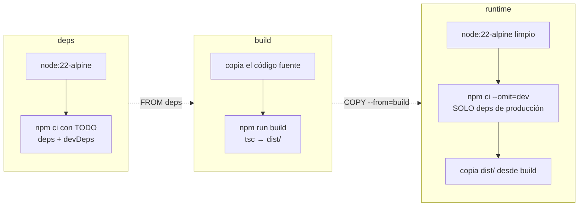
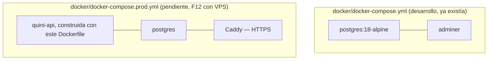

# 09 — Docker, paso a paso

> Documento de aprendizaje, no de especificación. Explica **por qué** el `Dockerfile` de este proyecto tiene la forma que tiene, qué salió mal al construirlo la primera vez y por qué cada arreglo es el correcto — no solo "cámbialo así". Corresponde a F12 (hardening/CI/deploy) del plan, la parte que no depende de tener ya un VPS.

Todo lo de aquí vive en dos ficheros, en la raíz del repo:

````
Dockerfile        — cómo se construye la imagen de la API
.dockerignore      — qué NO se copia dentro de la imagen
```eso

Y en `docker/docker-compose.yml` — que es un fichero **distinto y con un propósito distinto** (ver §5).

---

## 1. Por qué Docker aquí, y qué problema resuelve

Hasta ahora, "correr la API" significaba: tener Node 22 instalado, tener Postgres corriendo (vía `docker/docker-compose.yml`, solo para la base de datos), y ejecutar `npm run dev`. Eso funciona en tu máquina porque tu máquina ya tiene todo el contexto acumulado.

Un VPS no tiene nada de eso. Docker resuelve un problema muy concreto: **empaquetar la API entera —código compilado, dependencias de producción, y la versión exacta de Node— en una sola imagen** que se ejecuta igual en tu Mac, en CI y en el VPS. "Funciona en mi máquina" deja de ser una posibilidad, porque no se ejecuta "en tu máquina": se ejecuta dentro del contenedor, siempre con el mismo contenido.

Es la misma razón por la que ya usábamos Postgres embebido en los tests (docs/08 §5.1): un entorno aislado y reproducible es más fiable que confiar en el estado acumulado de una máquina concreta.

---

## 2. El `Dockerfile` completo

```dockerfile
# ---- deps: todas las dependencias (incluidas dev, hacen falta para compilar) ----
FROM node:22-alpine AS deps
WORKDIR /app
RUN npm install -g npm@12.0.2
COPY package.json package-lock.json ./
RUN npm ci --ignore-scripts

# ---- build: compila TypeScript a dist/ ----
FROM deps AS build
COPY . .
RUN npm run build

# ---- runtime: solo lo necesario para ejecutar en producción ----
FROM node:22-alpine AS runtime
WORKDIR /app
ENV NODE_ENV=production
RUN npm install -g npm@12.0.2

COPY package.json package-lock.json ./
RUN npm ci --omit=dev --ignore-scripts

COPY --from=build /app/dist ./dist
COPY drizzle ./drizzle
COPY openapi ./openapi

USER node

EXPOSE 3000

HEALTHCHECK --interval=30s --timeout=3s --start-period=10s --retries=3 \
    CMD wget --no-verbose --tries=1 --spider http://localhost:3000/health || exit 1

CMD ["node", "dist/src/server.js"]
````

### 2.1 Por qué tres `FROM` (multi-stage build)



Cada `FROM` abre una **etapa** nueva, con su propio sistema de ficheros. Lo importante es que la imagen final (`runtime`) **no hereda** de `build` — solo copia, con `COPY --from=build`, los dos únicos artefactos que necesita (`dist/`, y más abajo `drizzle/`/`openapi/`). Todo lo demás que existió en `deps`/`build` — el código TypeScript sin compilar, `node_modules` con `typescript`/`vitest`/`eslint`/etc. — se queda fuera y nunca llega a producción.

El resultado práctico: la imagen final pesa mucho menos y tiene mucha menos superficie de ataque (ni siquiera existe un compilador de TypeScript dentro), porque **solo lleva lo que hace falta para ejecutar `node dist/src/server.js`**, no para construirlo.

### 2.2 `npm ci`, no `npm install`

Las dos etapas usan `npm ci`, nunca `npm install`. La diferencia es importante y ya nos costó varios bugs reales descubrirla (§4):

|                       | `npm install`                          | `npm ci`                                                     |
| --------------------- | -------------------------------------- | ------------------------------------------------------------ |
| Lockfile              | lo actualiza si hace falta             | lo exige **exacto**, falla si no coincide con `package.json` |
| `node_modules` previo | lo reutiliza/parchea                   | lo borra y reinstala desde cero siempre                      |
| Velocidad             | más lento, más "inteligente"           | más rápido, determinista                                     |
| Cuándo usarlo         | cuando **tú** añades/quitas un paquete | en cualquier entorno automatizado: CI, Docker                |

`npm ci` es intencionadamente **estricto**: si el lockfile y `package.json` no cuadran al milímetro, falla en vez de intentar arreglarlo. Eso es exactamente lo que quieres en una imagen de producción — prefieres que el build falle ruidosamente a que instale "lo que buenamente pueda".

### 2.3 `--ignore-scripts` y `--omit=dev`

- **`--ignore-scripts`**: ninguna dependencia ejecuta su script `postinstall`/`prepare` durante el build. Esto incluye el `prepare: husky` del propio proyecto (§4.2) y cualquier postinstall nativo de terceros — dentro de un contenedor no hace falta ni lo uno ni lo otro.
- **`--omit=dev`** (solo en `runtime`): instala únicamente lo que está en `dependencies`, nunca `devDependencies`. Esto es lo que hace que `eslint`, `vitest`, `drizzle-kit`, `insomnia-inso`... no existan dentro de la imagen final. Es también la razón de que `npm audit` en local muestre muchas más vulnerabilidades que las que de verdad importan en producción: la mayoría viven en herramientas de _dev_ que esta línea excluye (ver conversación reciente sobre `npm audit --omit=dev`).

### 2.4 Alinear la versión de `npm` dentro y fuera del contenedor

```dockerfile
RUN npm install -g npm@12.0.2
```

Esta línea aparece en **ambas** etapas (`deps` y `runtime`) y existe por un motivo muy concreto, no es cosmética: `node:22-alpine` trae de fábrica `npm@10.9.8`, mientras que en local se venía usando `npm@12.0.2`. npm 10 y npm 12 validan de forma distinta si un lockfile está "completo" para paquetes opcionales específicos de plataforma (como los binarios nativos de `esbuild` para cada arquitectura) — un lockfile perfectamente válido generado con npm 12 puede ser rechazado por npm 10 con un `EUSAGE: "package.json and package-lock.json are not in sync"`, aunque no haya ningún problema real. Fijar la misma versión de npm dentro del contenedor que la que generó el lockfile en local elimina ese falso positivo.

### 2.5 `USER node`

Las imágenes oficiales `node:*` ya traen un usuario `node` sin privilegios (no `root`) creado de fábrica. `USER node` hace que el proceso de la API corra con ese usuario: si alguien consigue ejecutar código dentro del contenedor a través de una vulnerabilidad de la aplicación, no tiene privilegios de root dentro de él. Es defensa en profundidad, no la única barrera, pero es gratis y no hay motivo para no ponerla.

### 2.6 `HEALTHCHECK`

```dockerfile
HEALTHCHECK --interval=30s --timeout=3s --start-period=10s --retries=3 \
    CMD wget --no-verbose --tries=1 --spider http://localhost:3000/health || exit 1
```

Docker (y, en el VPS, `docker compose`) ejecuta este comando cada 30s dentro del propio contenedor. Si `GET /health` deja de responder 3 veces seguidas, Docker marca el contenedor como `unhealthy` — información que luego usa `restart: unless-stopped` en `docker-compose.prod.yml` para reiniciarlo solo, y que un orquestador (o tú, con `docker ps`) puede usar para saber que algo va mal sin tener que llamar a la API desde fuera.

Se usa `wget`, no `curl`: las imágenes `alpine` (basadas en BusyBox) traen `wget` instalado por defecto, pero no `curl` — añadir `curl` solo para el healthcheck sería una dependencia extra innecesaria.

`/health` es el mismo endpoint que ya existía en `src/app.ts`:

```ts
app.get("/health", (_req, res) => {
  res.status(200).json({ status: "ok", uptime: process.uptime() });
});
```

---

## 3. `.dockerignore`

```
node_modules
dist
coverage
.git
.github
*.log
log.txt
temp.txt
.env
.env.test
.DS_Store
docs
.codegraph
```

Cumple el mismo papel que `.gitignore`, pero para `docker build`: cualquier fichero que coincida aquí **nunca llega** al contexto de build, así que ni `COPY . .` (en la etapa `build`) puede verlo.

Dos líneas merecen explicación:

- **`.env`/`.env.test`**: nunca se debe copiar un fichero con secretos reales (contraseñas, `JWT_SECRET`, etc.) dentro de una imagen — cualquiera con acceso a la imagen (por ejemplo, en un registro como GHCR) podría extraerlo. Las variables de producción se pasan al contenedor en tiempo de **ejecución** (`docker run --env-file` o el `environment:` de `docker-compose.prod.yml`), nunca en tiempo de **build**.
- **`node_modules`**: aunque ya se instala de cero dentro de cada etapa con `npm ci`, si el `node_modules` local (con paquetes nativos compilados para tu Mac ARM) se colara en el contexto de build, podría acabar sobrescribiendo binarios pensados para Linux — justo el tipo de bug que costó tiempo diagnosticar (§4.5).

---

## 4. La cadena de bugs reales que apareció al construir esto

Esta sección es la parte más valiosa del documento: construir el `Dockerfile` fue la primera vez que este proyecto pasó por un `npm ci` genuinamente limpio (sin `node_modules` acumulado de meses de `npm install` sueltos). Eso hizo aflorar **seis bugs reales**, preexistentes, que un `npm install` normal llevaba tiempo enmascarando. La lección general, antes de los detalles: **un proyecto que solo se instala con `npm install` puede llevar bugs de dependencias invisibles durante mucho tiempo; `npm ci` (que es exactamente lo que hacen CI y Docker) los saca a la luz.**

### 4.1 `drizzle-kit` desactualizado

`npm run typecheck` fallaba en `drizzle.config.ts` (`import { defineConfig } from "drizzle-kit"`) porque el `package.json`/lockfile tenían fijado `drizzle-kit@^0.18.1` (de mediados de 2023, anterior a que existiera `defineConfig`), mientras que localmente había una versión más nueva instalada "por fuera" del lockfile. `npm ci` reinstala exactamente lo que dice el lockfile, así que expuso la versión real y vieja. Arreglo: subir a `^0.31.10`.

### 4.2 `allowScripts`: bloquear scripts de instalación por defecto

Esta versión de npm bloquea por defecto los scripts `postinstall`/`prepare` de cualquier dependencia, salvo que se aprueben explícitamente en el campo `allowScripts` de `package.json` (`npm install-scripts approve/deny/ls`). Decisiones tomadas para este proyecto:

```json
"allowScripts": {
    "@embedded-postgres/darwin-arm64@18.4.0-beta.17": true,
    "esbuild@0.18.20": true,
    "esbuild@0.25.12": true,
    "esbuild@0.28.1": true,
    "esbuild@0.28.2": true,
    "fsevents@2.3.3": true,
    "node-libcurl@2.3.3": false,
    "@getinsomnia/node-libcurl@2.3.4-3": false,
    "@scarf/scarf": false
}
```

- **Aprobados**: `@embedded-postgres/*` (su postinstall recrea symlinks de librerías ICU que hacen falta para levantar el Postgres embebido de los tests — sin esto, los tests fallan con `dyld: Library not loaded`), y `esbuild` (su postinstall descarga el binario nativo correcto para la plataforma actual; lo usan `tsx`, `vitest` y `drizzle-kit`).
- **Denegados**: `@scarf/scarf` (solo telemetría de `spectral-cli`, sin función real) y `node-libcurl`/`@getinsomnia/node-libcurl` (dependencia de `insomnia-inso`, usada solo por el script opcional `npm run insomnia:test`, que CI nunca llama; su build nativo fallaba en Apple Silicon por no encontrar Python para `node-gyp`).

Importante: aprobar un paquete **no** re-ejecuta su script si ya estaba instalado sin ejecutarlo — hace falta `npm rebuild <paquete>` para forzarlo.

### 4.3 Colisión de binarios: `spectral`

`insomnia-inso` arrastra, como dependencia transitiva, el paquete `@stoplight/spectral@5.9.2` (el viejo, monolítico) — y ese paquete también expone un binario llamado `spectral`, el mismo nombre que usa nuestro `@stoplight/spectral-cli@6.16.3` (el bueno, con soporte OpenAPI 3.1). npm solo puede dejar un `spectral` en `node_modules/.bin/`, y se quedó con el equivocado — por eso `npm run openapi:lint` reportaba siempre `unrecognized-format` sobre un documento OpenAPI 3.1 perfectamente válido.

Arreglo, en `package.json`, evitando el `.bin` ambiguo y apuntando directamente al fichero de entrada del paquete correcto (el mismo patrón que ya se usaba para `drizzle-kit`):

```json
"openapi:lint": "node node_modules/@stoplight/spectral-cli/dist/index.js lint openapi/openapi.json"
```

### 4.4 `cookie-parser`: usado en el código, nunca declarado

`src/app.ts` importa y usa `cookieParser` desde hace tiempo, pero `cookie-parser` **no estaba en `package.json`** — funcionaba en local porque quedaba una copia suelta en `node_modules` de alguna instalación anterior. Un `npm ci` limpio dentro de Docker no tiene esa copia suelta: `tsc` fallaba con `Cannot find module 'cookie-parser'`, y luego, ya en runtime, con `ERR_MODULE_NOT_FOUND`.

Arreglo, con un matiz que también costó una pregunta: `cookie-parser` es código que se ejecuta en producción, así que va en `dependencies`; `@types/cookie-parser` es solo para `tsc` en tiempo de desarrollo, así que va en `devDependencies` — y por eso, con `--omit=dev`, solo el primero sobrevive en la imagen final (que es justo lo que hace falta, porque `dist/` ya es JavaScript compilado, sin tipos).

### 4.5 Falta copiar `openapi/` en la imagen final

`src/app.ts` lee `openapi/openapi.json` del disco en tiempo de arranque (`readFileSync`, para servir `/openapi.json` y `/docs`), pero la etapa `runtime` del `Dockerfile` solo copiaba `dist/` y `drizzle/` — nunca `openapi/`. El síntoma: `docker run` arrancaba y luego crasheaba al intentar leer un fichero que no existía dentro de la imagen. Arreglo: añadir `COPY openapi ./openapi`.

### 4.6 Desajuste de versión de `npm` (ya explicado en detalle en §2.4)

`docker build` fallaba con `EUSAGE "package.json and package-lock.json are not in sync"`, listando como "Missing" el paquete `esbuild@0.28.2` y sus ~28 `optionalDependencies` de plataforma — justo después de que el mismo lockfile pasara sin problema un `npm ci` limpio en local. La causa era la diferencia de versión de npm entre el host y `node:22-alpine` (§2.4); el arreglo fue fijar `npm@12.0.2` dentro de ambas etapas del `Dockerfile`.

---

## 5. Dos `docker-compose.yml` con propósitos distintos — no confundirlos



- **`docker/docker-compose.yml`** (ya existente, F3): levanta **solo Postgres** (+ Adminer para inspeccionarlo a mano) para desarrollar en local con `npm run dev`. La API en sí corre directamente con Node en tu máquina, sin contenedor.
- **`docker/docker-compose.prod.yml`** (pendiente, ver docs/00-Plan-inicial.md §15): en el VPS, levanta **todo junto** — la API ya empaquetada con el `Dockerfile` de este documento, Postgres, y Caddy delante haciendo de proxy inverso con HTTPS automático. Es el fichero que todavía no existe porque depende de tener el VPS.

Este documento (09) cubre solo el `Dockerfile` en sí — cómo se construye la imagen de la API — que es la pieza que **no** depende de tener ya un servidor.

---

## 6. Comandos para probarlo en local

```bash
# construir la imagen (desde la raíz del repo)
docker build -t quini-api .

# ejecutarla, pasando las variables de entorno necesarias
docker run --rm -p 3000:3000 --env-file .env quini-api

# en otra terminal, comprobar que responde
curl -s http://localhost:3000/health
# {"status":"ok","uptime":25.8}
```

Nota: para que la API conecte a una base de datos, `DATABASE_URL` dentro del contenedor no puede apuntar a `localhost` (eso sería "dentro del propio contenedor", no tu Postgres de Docker Compose) — necesita la dirección de red del contenedor de Postgres o, en Docker Desktop en Mac, `host.docker.internal`. Esto se resuelve de forma definitiva con `docker-compose.prod.yml`, donde ambos servicios comparten una red interna y se llaman por nombre de servicio (`postgres`, no `localhost`) — exactamente como ya hace `docker/docker-compose.yml` con `adminer` → `postgres`.

---

## 7. Cómo encaja con CI (`.github/workflows/ci.yml`)

```yaml
name: CI

on:
  push:
    branches: [main]
  pull_request:

jobs:
  ci:
    runs-on: ubuntu-latest
    steps:
      - uses: actions/checkout@v4

      - uses: actions/setup-node@v4
        with:
          node-version: "22"
          cache: npm

      - name: Instalar dependencias
        run: npm ci

      - name: Typecheck
        run: npm run typecheck

      - name: Lint
        run: npm run lint

      - name: Tests
        run: npm test

      - name: Preparar .env para generar OpenAPI
        run: cp .env.test .env

      - name: Regenerar OpenAPI
        run: npm run openapi:generate

      - name: Formatear OpenAPI (igual que el pre-commit)
        run: npx prettier --write openapi/openapi.json

      - name: Lint de OpenAPI
        run: npm run openapi:lint

      - name: Comprobar que openapi.json está actualizado
        run: git diff --exit-code openapi/openapi.json
```

Dos detalles no obvios:

- **`npm ci`, no `npm install`, también aquí** — por la misma razón que en el `Dockerfile` (§2.2): CI debe fallar si el lockfile no está sincronizado, nunca "arreglarlo" silenciosamente.
- **El paso "Formatear OpenAPI"**: `husky`/`lint-staged` reformatea `openapi/openapi.json` con Prettier en cada commit local (`"*.{json,md,yml}": "prettier --write"`). Pero `npm run openapi:generate` por sí solo escribe el JSON con `JSON.stringify(doc, null, 2)`, con un formato ligeramente distinto (arrays cortos en una línea vs. multilínea). Sin este paso, el `git diff --exit-code` final compararía peras con manzanas y fallaría siempre, aunque el contenido semántico fuera idéntico — de ahí que CI reproduzca aquí el mismo paso de formateo que ya corre en el `pre-commit` local.

Este workflow **todavía no construye ni publica la imagen Docker** — eso es trabajo de `.github/workflows/deploy.yml` (pendiente, depende del VPS: build → push a GHCR → SSH → migrar → `up -d`).

---

## 8. Glosario rápido

| Término               | Qué es aquí                                                                                                                                                                                |
| --------------------- | ------------------------------------------------------------------------------------------------------------------------------------------------------------------------------------------ |
| **Multi-stage build** | Varios `FROM` en un mismo `Dockerfile`; cada uno es una etapa con su propio sistema de ficheros, y una etapa posterior puede copiar (`COPY --from=`) solo lo que necesita de una anterior. |
| **`npm ci`**          | Instalación estricta y determinista: exige que el lockfile cuadre exacto con `package.json`, borra `node_modules` y reinstala siempre desde cero.                                          |
| **`--omit=dev`**      | Instala solo `dependencies`, nunca `devDependencies` — así de pequeña y limpia queda la imagen final.                                                                                      |
| **`allowScripts`**    | Campo de `package.json` que aprueba o deniega, paquete a paquete y por versión exacta, la ejecución de sus scripts `postinstall`/`prepare`.                                                |
| **`HEALTHCHECK`**     | Instrucción de Docker que define cómo comprobar, desde dentro del propio contenedor, si el proceso sigue sano.                                                                             |
| **`.dockerignore`**   | Lista de ficheros que nunca entran en el contexto de build — el equivalente de `.gitignore` para `docker build`.                                                                           |
| **GHCR**              | GitHub Container Registry — dónde se publicará la imagen construida en CI, para que el VPS pueda descargarla (pendiente, F12).                                                             |
